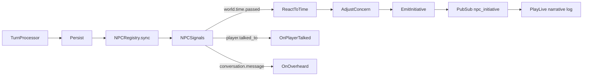
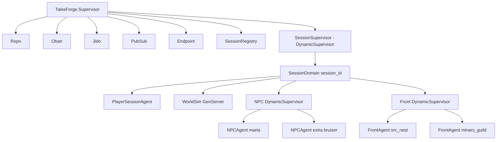

# Tales Forge Game Architecture: Fronts, Simulation, and the Table GM

| Field | Value |
|-------|--------|
| **Title** | Tales Forge Game Architecture |
| **Author** | Architecture (draft) |
| **Date** | 2026-08-20 |
| **Status** | Draft |
| **Repo** | ex-tales-forge |
| **Canonical copy** | `docs/architecture.md` |
| **Out of scope** | Scene/NPC image generation (`feature/scene-image-generation`); Tigris permanent storage |

This document is the product spec and the implementation map. It describes how the game runs **today**, the agreed architecture around **fronts / antagonist plans**, the BEAM process topology, the LLM split (table GM vs chronicler), and a tracer-first PR plan. Locked decisions are recorded, not reopened.

---

## Overview

Tales Forge is a text-first, instanced AI RPG on the BEAM: Phoenix LiveView for the table, Jido agents for hot session/NPC runtime, Ecto + PostgreSQL for persistence, Oban for LLM and (later) simulation jobs. Ash owns **pre-play authoring** only. The play loop is 100% Ecto.

Today the loop is a two-tier LLM turn against a static location graph. NPCs have personality, OCEAN traits, and a `current_concern` that can escalate into proactive speech. That is a person with a worry — not an adventure. **Crossroads Ledger** is a missing-ledger hook with no opposing plan that has resources, clocks, or the ability to act off-screen. The table waits. The world does not run.

The product thesis is locked: **the adventure is not a quest list.** It is what happens when the player's actions interfere with the plans of the major antagonists of an area, and when those antagonists interfere with each other.

The proposed architecture introduces **authored fronts** (2–3 per area) as first-class runtime entities. Each front has a goal, personality, resources, beliefs (not omniscience), clocks, portents, and structured memories. After the existing table-GM turn, events — including hidden ones — hit live fronts. Authored rules fire first. When a branch cannot be enumerated, a **chronicler** LLM picks **one legal next move** from a server-enforced palette. The table GM remains the only voice the player hears, and it may only narrate what this player perceived. Faction thinking never blocks the player's turn.

The first playable slice is a dedicated tracer pack with two fronts (orc nest, miners guild), **no chronicler LLM**, and tests that fail if missed scouts leak into the **post-travel scene prompt** or if the nest is unprepared after a miss. That slice is not playable against today's `create_session/1` until PR-2 materializes `tin_valley` (Ash adventure_id alone is not enough).

---

## Background & Motivation

### Current state (what actually runs)

The OTP root in `lib/ex_tales_forge/application.ex` is a **flat** `:one_for_one` supervisor:

```
TalesForge.Supervisor
  ├── TalesForgeWeb.Telemetry
  ├── TalesForge.Repo
  ├── Oban                         # queues: default:10, llm:5, images:3
  ├── TalesForge.Jido              # global Jido runtime (max_tasks: 1000 = Task.Supervisor max_children, not agent cap)
  ├── TalesForge.NPCRecovery       # re-syncs present NPC agents on boot
  ├── DNSCluster
  ├── Phoenix.PubSub
  └── TalesForgeWeb.Endpoint
```

There is **no session supervisor**. `PlayerSessionAgent` (`lib/ex_tales_forge/agents/player_session_agent.ex`) is a thin Jido agent (`session_id`, `turn_count`, `entries`) started by `GameSessions.ensure_agent/1` with id `session-{id}`. NPC agents live under the same global Jido runtime, keyed `npc-{session_id}-{npc_id}`, started/stopped by `TalesForge.NPCRegistry` to match `world_state["present_npcs"]`.

One `GameSession` (`lib/ex_tales_forge/schemas/game_session.ex`) is one instance. Mutable world is a JSON map (`world_state`) plus related rows:

| Table / schema | Role |
|----------------|------|
| `game_sessions` | Instance: `name`, `status`, `world_state`, unused `world_clock` UTC column |
| `turns` | Auditable history: `player_action`, `narrative`, `mechanical_resolution` |
| `scenes` | Per `(session, location_id)` exposition + optional `image_url` |
| `npc_instances` | Per-session NPC: `personality` (authored copy) + `runtime_state` |

`world_state` today (seeded by `TalesForge.Game.World.default_world_state/0`) holds `adventure_id`, `location_id` / `location_name`, `present_npcs`, `world_tick` / `world_clock` label, `last_scene_location`, `situation_lines`, `character`, `npc_state` (display snapshot), and `locations`. Time is discrete: `TalesForge.Game.WorldClock.advance/2` adds **+1 tick per player turn** (1 tick ≈ 15 in-game minutes; 4 ≈ 1 hour; 96 ≈ 1 day). There is **no wall-clock while idle**. Off-screen actors currently do almost nothing.

Play pipeline (`AGENTS.md` + `GameSessions` + workers):

```
create_session
  → NPC.seed_session (all priv/npcs/*.json or Ash NpcDefinition)
  → NPCRegistry.sync (agents only for present_npcs)
  → ProcessScene (Oban :llm) until last_scene_location == location_id
submit_message
  → require scene ready
  → Tier 1 Intent (heuristic if confidence ≥ 0.85, else LLM; raw text never reaches Tier 2)
  → ProcessTurn (Oban :llm)
       LLM.complete_turn (table GM JSON)
       Mechanics.apply_server_mechanics (server 1d20 + LP)
       Inventory.apply_server_inventory
       WorldClock.advance(+1)
       NPC.apply_gm_updates (npc_memory_updates + npcs/* state_updates)
       persist GameSession + Turn
       NPCRegistry.sync
       NPCSignals.emit_turn_signals
       PubSub {:turn_completed, payload}
```

NPC agency today is **present-only**:

- `world.time.passed` → `ReactToTime` → `AdjustConcern` (priority +1 every 4 wait ticks) → `EmitInitiative` if priority ≥ 8 and wait ≥ 4.
- `player.talked_to` → memory + relationship +0.05.
- `conversation.message` → overheard memory for non-target present NPCs.
- Memories: last 20 on the instance; last 5 concatenated into the table GM prompt via `NPC.format_gm_sections/2`. **Only present NPCs.** Distant facts rot out of the prompt.

Marta (`priv/npcs/marta_kellen.json`) has `agency_tier: "normal"`, OCEAN, and `current_concern: {focus: "missing ledger", priority: 8}`. After four ticks of worry she speaks about the ledger (`NPC.initiative_text/1`). That is a **baby front**: a person with a concern, not a plan with scouts, coin, and a portent.

### Pain: Crossroads Ledger does not run

`priv/adventures/crossroads_ledger/adventure.md` is a hook: a missing merchant ledger, Marta at The Weary Pilgrim, Henrik Bale (`worried_merchant`) at the square. There is **no opposing plan with resources**. No one is looking for the ledger off-screen. No guild is hiring steel. No nest is preparing. The player can drink forever; the world waits. That is a scene, not an adventure.

Secondary pains that this architecture must close:

1. **Omniscient GM prompt.** `Context.format_gm_prompt/1` concatenates pack rules, formatted intent (including `situation_lines` and recent-turn **player** text slices), and `NPC.format_gm_sections/2`. It does **not** dump raw `world_state`. The leak today is `NPC.merged_npc_context/1` putting the full `runtime_state` (memories, concern wait-ticks, initiative flags) into the present-NPC JSON. Front clocks would be a second leak if injected the same way. `context_summary` → `situation_lines` can persist invented hidden facts across later turns.
2. **GM invents mechanics.** `Mechanics` rolls 1d20 and awards LP, but social outcomes are unbounded: a nat-1 intimidation can be narrated as "he tells you everything" because `gm_system.txt` does not constrain by relative power, personality, or beliefs. `overlay_deltas` are decoded and **never applied**.
3. **Memories are not retrieved.** Last-5 of present NPCs is not "last year's slight." If the fact never reaches the prompt, the sim does not matter.
4. **OTP is global, not a session crash domain.** An NPC agent crash is isolated by Jido, but there is no session-shaped supervisor for WorldSim / fronts / extras. Geography is not (and must not become) a supervision tree.

### Adjacent work (not this design)

Image generation (Grok sketches for scenes and NPC portraits) lives on `feature/scene-image-generation` and in `TalesForge.Workers.GenerateImage` / Oban `:images`. Tigris permanent storage is deferred. This document mentions images only as an existing async pattern: **table returns, Oban thinks, PubSub patches the UI**.

---

## Goals & Non-Goals

### Goals

1. Encode the product thesis: play is interference with **authored antagonist plans**, and plans interfering with each other.
2. Make one **playable tracer** (orc nest + miners guild) where hidden events change later scenes without leaking into the current narration.
3. Keep the existing two-tier turn (intent → table GM) and **do not block** the player on faction LLM.
4. Give fronts a legal move palette the **server enforces** (no hire if coin is 0).
5. Split LLM roles: **table GM** narrates perceived facts; **chronicler** picks one legal JSON move when rules cannot enumerate the branch.
6. Persist structured memories/debts so later retrieval can put last year's slight back in the prompt.
7. Define a session-shaped OTP topology as a **failure domain**, not a map.

### Non-goals

- Shared MMO world / one atlas for all players.
- Wall-clock or AFK simulation while the player is logged off.
- Fully generative politics at session start (inventing major antagonists).
- CK3-scale character/title simulation.
- Location-tree OTP (Inn under Village under Region).
- Occupied `LocationAgent` processes (optional later; not required for the tracer).
- Image generation / Tigris.
- Porting text-forge Supabase code.
- Putting runtime fronts in Ash.
- Mixing Ash into `TurnProcessor`, `GameSessions` play paths, Jido, or Oban workers.

---

## Human GM Habits → System

This is the product spec. Each habit maps to a concrete subsystem. If the mapping is missing, the habit is not encoded.

| # | Human GM habit | System encoding | First lands in |
|---|----------------|-----------------|----------------|
| **a** | Enact NPCs with believable actions from personality, means, resources. | Fronts and NPCs carry OCEAN / personality, `resources` (coin, troops, scouts), and a **legal move palette**. Server rejects moves the actor cannot afford. Table GM narrates present people from `NpcInstance` + retrieved memories; chronicler never writes prose. | Tracer: nest `raise_alert` from scout clock (rule). Later: extras act from `job` + parent resources. |
| **b** | Track events outside player awareness; may nudge/fudge off-screen clocks when that would be *believable* — still JSON, still legal palette; may **not** invent a major villain to save pacing. | `session_events` with `player_aware: false`. WorldSim applies authored clock rules (including authored fudge windows, e.g. "scout overdue ±1 tick"). Chronicler may pick `stall` / `send_messenger`, never a new `front_id`. | Tracer: missed scouts set `alert=prepared` with no narration. |
| **c** | Can invent **minor** NPCs in a session; major NPCs / villains / fronts only outside a session (pack / between-session). | Authored fronts and major NPCs live in the pack. Chronicler may emit `extra: {id, parent_front_id, job}` → `NpcInstance` with `origin: "extra"`. If the model emits a new `front_id`, **drop it**. | PR-7 (extras). Tracer has no extras. |
| **d** | Entertainment is subjective; do not chase hack-and-slash dice theater. | Adventure comes from plan interference, not from forcing combat checks. `ActionHandler` already skips dice on `move` / `inventory`. Table GM prompt: do not invent fights to fill a turn. Social checks produce **bounded outcomes**, not mind control. | Tone in PR-4 prompt; dice bounds in PR-9. |
| **e** | Later consequences (including a year later) are the payoff. Memories must be durable structured facts and **retrieved** into GM/chronicler context. | Memory shape `{who, tick, what, felt}` on NPC **and** front. Persist beyond the current 20-cap hot list (archival table or uncapped events). Retrieval query: relevance to location, live fronts, player action, debts — not "last 5 of whoever is in the room." If the fact never reaches the prompt, the sim does not matter. | Tracer writes structured memories and **asserts the nest still has the approach memory after a miss**. Retrieval quality is PR-8. |

Marta remains a **person with a concern**, not a front. The thing under the mine is a front **after** an authored portent fires, not because the chronicler got bored.

---

## Key Decisions

1. **Instanced campaigns, not an MMO.** Each `GameSession` is its own copy of the pack. 1000 concurrent players = 1000 small trees. Rejected: shared world, cross-session fronts, global location occupancy.

2. **World time advances on player turns only.** `WorldClock.advance/2` already does +1 tick per turn. No wall-clock while idle or logged off. Off-screen actors react on those ticks and on events the turn produced.

3. **Background brain = authored rules + clocks first.** The chronicler LLM picks **one legal next move** (JSON) only when the branch cannot be enumerated. It is not a second storytelling GM.

4. **Table GM is the only voice the player hears.** It reads world facts through a **perception filter**. It must not narrate facts the player did not perceive. It must not invent that a faction "doesn't know" when their beliefs say they do (if the player can observe the faction acting).

5. **Tone: thinking-person's game.** Server dice inform; they do not puppet people. Intimidation / nat-1 must not mean "he tells you everything." Outcome bounds come from relative power, personality (OCEAN already on NPC defs), and beliefs. Lands fully in PR-9; tracer does not wait on it.

6. **OTP supervisors are failure domains, not geography.** Do not nest Inn under Village under Region. Hierarchy of places is authored data (`locations` + pack markdown) plus PubSub topics (`session:{id}:location:weary_pilgrim`). A front is not the parent of its rooms or soldiers.

7. **2–3 fronts per area.** Marta is usually a person with a concern. The thing under the mine is a front after a portent fires.

8. **Author fronts and portents in the pack. Simulate moves. Allow extras in a live session; never invent major antagonists/fronts mid-session.** New `front_id` from the model → drop. `extra: guild_bruiser_3` with parent front + job → keep.

9. **Do not block the player on faction LLM.** `ProcessTurn` returns after table GM + **synchronous rule tick**. Chronicler is an Oban job; the next turn/scene reads new facts.

10. **Runtime fronts are Ecto (`FrontInstance`), not Ash, not stuffed into `world_state`.** Same split as `NpcInstance`. Ash may grow `Authoring.FrontDefinition` in Phase 2 for pack import; play paths never call it.

11. **Tracer pack is a new adventure (`tin_valley`), not a Crossroads extension.** Existing `crossroads_ledger` tests, `mix e2e.smoke` (Marta / chalk / square), and `World.default_world_state/0` stay green. `create_session(%{adventure_id: "tin_valley"})` is **not** plumbed today — PR-2 adds `Pack.load/1` and fixes materialization. Crossroads can gain a real opposing front later; it is not the first proof.

12. **WorldSim starts as a pure module called from `TurnProcessor`, not a GenServer.** SessionSupervisor + Front DynamicSupervisor thicken after the tracer is playable (PR-5). Do not build the tree to discover the game.

13. **Legal moves are a closed palette the server enforces.** `raise_alert | spend_coin | send_messenger | hire_extra | withdraw | lie | mark_debt | stall`. Preconditions are data (coin, scouts, clocks). The LLM may not invent a fourth resource.

14. **Image generation is adjacent, not this design.**

15. **Session create is a dual path, keyed by `adventure_id`.** `adventure_id` is not a `GameSession` column (`changeset` casts `name | status | world_state | world_clock`). **tin_valley** (and later complete packs) uses `TalesForge.Game.Pack.load/1` fail-fast: connected `exits`, pack NPCs only, pack fronts. **crossroads_ledger** (default, HomeLive, `mix e2e.smoke`) keeps **today’s seed**: `World.default_world_state/0` and/or existing `resolve_adventure_world_state/1`, `priv/npcs/*.json` including Henrik, dangling `kings_road` allowed, **zero** fronts. Do **not** run Crossroads through tin_valley’s fail-fast loader. Tracer sessions: `create_session(%{name: "Tin Valley", adventure_id: "tin_valley"})` from tests/IEx.

16. **One DB transaction per player turn for session, turn, events, and front patches.** `TurnProcessor` persists those four together (`Ecto.Multi`) **after** WorldSim and **before** `NPCRegistry.sync` / signals / `{:turn_completed, payload}`. Scene jobs reload from Postgres; if the Multi is missing, the approach/nest scene sees stale clocks. A failed tick must not leave a `Turn` row without matching `session_events` / `FrontInstance` updates.

---

## How the Game Runs Today (detailed)

### Session lifecycle

`TalesForge.GameSessions.create_session/1` **today**:

1. Reads `adventure_id` from attrs (or defaults to `"crossroads_ledger"`). That key is **not** a `GameSession` field — `GameSession.changeset/2` casts only `name | status | world_state | world_clock`, so extra keys are dropped at insert.
2. `resolve_adventure_world_state/1` succeeds only if Ash `Authoring.Adventure` has a matching row. `priv/repo/seeds.exs` seeds **only** `crossroads_ledger` (plus Marta/Henrik `NpcDefinition`s and three Crossroads locations). On Ash miss it returns `nil` and the session uses `World.default_world_state/0` (`adventure_id: "crossroads_ledger"`, start `weary_pilgrim`, tick 36 = "Day 1 · late afternoon").
3. Even when Ash **does** match, the materializer copies Crossroads leftovers: `location_name` stays `"The Weary Pilgrim"`, `character.location_id` stays `weary_pilgrim`, `situation_lines` stay Marta / tavern door. `TurnProcessor.apply_location_updates/1` then uses `Context.current_location_id/1`, which **prefers `character.location_id`**, so the first turn snaps the player back to the Pilgrim. `Context.build_intent_context/1` falls back to `present_npcs: ["marta_kellen"]` when the list is empty.
4. Inserts `GameSession`. Default `name` is `"Crossroads Hamlet"` (`create_session/1` Map.merge) unless attrs pass `name`.
5. `NPC.seed_session/1` inserts an `NpcInstance` for **every** Ash `NpcDefinition` or, if Ash is empty, **every** `priv/npcs/*.json` (Marta **and** Henrik). There is no `adventure_id` filter (`NpcDefinition` identity is globally unique).
6. `present_npcs` is whoever shares the player's location (`NPC.sync_present_npcs/2`).
7. Starts `PlayerSessionAgent`; `NPCRegistry.sync/1` starts agents only for present NPCs.
8. `ensure_scene/1` enqueues `TalesForge.Workers.ProcessScene` if `last_scene_location != location_id`.

`HomeLive` hardcodes `create_session(%{name: "Crossroads Hamlet", adventure_id: "crossroads_ledger"})`. That stays. Tracer play is tests / IEx / `PlayLive` on a session id — not a new home-screen button.

Player input is blocked in `PlayLive` while `scene_loading` or `thinking` (`input_disabled`). `submit_message/3` returns `{:error, :needs_scene}` if the scene is pending.

**After travel**, `PlayLive.maybe_start_scene_after_travel/3` enqueues `ProcessScene` from `{:turn_completed, payload}` when `needs_scene: true`. That worker **reloads the session from the DB**. WorldSim patches must be committed before broadcast or the new location's scene is stale. The travel-turn table GM itself is built from the **pre-move** session (`Context.build_gm_context(session)` at the top of `TurnProcessor.run/3`) — it is the **wrong** leak surface (see TurnProcessor hook).

### Two-tier LLM (non-negotiable, kept)

| Tier | Where | Model / temp | Input | Output |
|------|-------|--------------|-------|--------|
| 1 Intent | `GameSessions.resolve_and_enqueue/3` **before** Oban | Heuristic if ≥ `TIER1_HEURISTIC_THRESHOLD` (0.85); else `LLM.complete_intent` temp 0, 400 tokens | Raw player text + intent context | `PlayerAction` JSON |
| 2 Table GM | `TurnProcessor.run/3` inside `ProcessTurn` | `LLM.complete_turn` temp 0.7, 700 tokens | Validated `PlayerAction` + handler + rules + present NPCs | `GMStructuredResponse` (narrative, state_updates, npc_memory_updates, …) |
| Scene | `SceneProcessor` / `ProcessScene` | Same model as Tier 2 | Location + GM context | `{location_name, narrative}` |

Raw player text never reaches Tier 2 (`Intent.sanitize_summary/1` strips instruction-injection phrases; `gm_system.txt` restates this). `TalesForge.LLM` is the only LLM client. Config lives in `TalesForge.Config`. Target: full turn < 3s (`mix e2e.smoke`).

### Server dice (kept, later bounded)

`TalesForge.Game.Mechanics.apply_server_mechanics/4` rolls 1d20 vs effective skill (base + stat bonus). Outcomes: success / partial_success / failure. LP written onto `character.learning_points`. The GM is told not to invent rolls (`priv/prompts/gm_system.txt`) and not to patch LP or inventory. Skill is skipped for `move` and `inventory` handlers.

**Gap:** there is no `outcome_bounds` structure. Social skills (intimidation, persuasion, deception) use the same numeric curve as climbing. Personality and relative power are prompt flavor, not a contract.

### NPC runtime (seed of fronts)



This is the right *shape* (signals, rule-based concern, persist then notify) and the wrong *scope* (present people only; no resources; no hidden events).

### Pack vs runtime (ETC, kept)

| Layer | Owner | Examples |
|-------|-------|----------|
| Human-readable authored | `priv/rules/*.md`, `priv/prompts/*.txt`, `priv/adventures/**`, `priv/npcs/*.json` | Crossroads Ledger, Marta JSON |
| Pre-play working copy | Ash `Authoring.*` via `Authoring.Importer` | `adventures`, `locations`, `npc_definitions` |
| Live play | Ecto `GameSession`, `Turn`, `NpcInstance`, `Scene` | `world_state` JSON + instance rows |
| Admin surfaces | Ash `AdminResources.*` over the same tables | `/admin` JSON editors |

Do not merge these layers. Fronts follow the same split: pack JSON/markdown → optional Ash `FrontDefinition` (Phase 2 importer) → Ecto `FrontInstance`.

### Pack materialization (PR-2; dual path — do not break Crossroads)

`create_session(%{adventure_id: "tin_valley"})` is **not** plumbed today. PR-2 must add it **without** routing the default adventure through a fail-fast loader. `priv/adventures/crossroads_ledger/world/crossroads_square.md` and `World.default_world_state/0` list `kings_road` in `exits` with **no** `kings_road` location. Henrik (`worried_merchant`) lives in `priv/npcs/worried_merchant.json`, not in the pack `npcs/` folder. `mix e2e.smoke` and `npc_hardening_test.exs` require both.

**One dispatcher, two implementations.** `GameSessions.create_session/1` reads `adventure_id` from attrs (else `"crossroads_ledger"`) and calls **one** function that branches. Do not leave `resolve_adventure_world_state/1` overlapping `Pack.materialize/1` for the same adventure.

| | **tin_valley** (and later complete packs) | **crossroads_ledger** (default) |
|--|------------------------------------------|----------------------------------|
| World | `Pack.load/1` → `Pack.materialize/1` | **Today’s seed**: `World.default_world_state/0`, with existing Ash overlay `resolve_adventure_world_state/1` if an Adventure row exists |
| Exit graph | **Fail fast** if any `exits` id is missing from `locations`, if start is missing, if portent `spawns_front` is missing | **Allow dangling exits** (`kings_road`). Do not call fail-fast `Pack.load/1` |
| NPCs | Pack `npcs/` only (innkeep, guild_steward). No Marta, no Henrik | **Today:** every Ash `NpcDefinition` or every `priv/npcs/*.json` (Marta **and** Henrik) |
| Fronts | Two live + one dormant | **Zero** (`Fronts.seed_session/1` no-op) |
| Character | `World.default_world_state()["character"]` then `Map.put("location_id", starting_location_id)` | Unchanged Elara in `World.default_world_state/0` (`location_id: "weary_pilgrim"`) |
| Opening lines | Pack `situation_lines` | Unchanged Marta / tavern door |
| HomeLive / e2e | Not used | Must stay green |

**Loader (tin_valley only at create time):** `TalesForge.Game.Pack.load(adventure_id)` reads `priv/adventures/<adventure_id>/` and returns:

```elixir
%{
  adventure_id: "tin_valley",
  name: "Tin Valley",
  starting_location_id: "valley_inn",
  initial_present_npc_ids: ["innkeep"],
  situation_lines: ["You have just pushed through the inn door.", "The valley road runs east toward the cut."],
  locations: %{location_id => %{id, name, exits, blurb, fixtures, ground_items}},
  npcs: [%{id, name, default_location_id, ...}],
  fronts: [%{id, status, ...}]
}
```

Fail fast **on this path** if the directory is missing, if `starting_location_id` is not in `locations`, if any `exits` id is missing from `locations`, or if a portent `spawns_front` is not in `fronts`. Crossroads is never this path.

**`Pack.materialize("tin_valley")` world_state:**

- `"adventure_id"` => `"tin_valley"`
- `"location_id"` / `"location_name"` from pack start (`valley_inn`)
- `"character"` => `World.default_world_state()["character"]` (the existing Elara: stats, stealth/insight, inventory, wounds) then `Map.put("location_id", starting_location_id)`. **Do not invent a second roster.**
- `"locations"` = pack graph including `exits`
- `"situation_lines"` = pack opening lines (no Marta)
- `"present_npcs"` = `initial_present_npc_ids`
- `"last_scene_location"` => `nil`
- `"live_fronts"` = ids with pack `status == "live"`
- `"public_facts"` => `[]`
- `"world_tick"` / `"world_clock"` as in `World.default_world_state/0`

Strip unknown keys (`adventure_id` is not a schema field) before `GameSession.changeset/2`. Tracer tests pass `name: "Tin Valley"`.

**`NPC.seed_session/1` after PR-2:**

```elixir
def seed_session(session) do
  case Context.adventure_id(session.world_state) do
    "tin_valley" -> seed_from_pack(session, Pack.load("tin_valley").npcs)
    _ -> seed_legacy(session)  # today’s Ash-or-priv/npcs/*.json (Marta + Henrik)
  end
end
```

**`Fronts.seed_session/1`:** pack fronts for tin_valley; **no-op** for Crossroads.

**`resolve_adventure_world_state/1`:** remains the Crossroads/Ash overlay only. Do not “fix” it by switching Crossroads onto `Pack.load/1`. Optional later hygiene (not PR-2 merge bar): when Ash matches Crossroads, still start from `World.default_world_state/0` so Elara/situation_lines stay DRY.

**Ash path (optional overlay, not the tracer gate):** `mix tales.import_pack priv/adventures/tin_valley --yes` writes `Authoring.Adventure` / `Location` / `NpcDefinition`. It does **not** understand `fronts/*.json` yet — Phase 2. Tests must not require a prior mix task. Do not seed tin_valley NPCs into the **global** `NpcDefinition` identity in a way that `seed_legacy/1` would insert innkeep into Crossroads sessions.

**`Context.build_intent_context/1`:** gate the `present_npcs: [] → ["marta_kellen"]` fallback on `adventure_id == "crossroads_ledger"`. Empty present is valid on tin_valley (empty road). Do **not** remove the fallback for Crossroads in PR-2.

**`TurnProcessor.apply_location_updates/1`:** use `World.runtime_location(world_state, location_id)`, never `World.location/1`. Crossroads `world_state["locations"]` already includes the three places (and dangling `kings_road` on the square); `runtime_location/2` still resolves known ids. `World.scene_image_url/1` is adjacent (images).

**WorldSim on Crossroads turns:** `Fronts.list_all/1` is `[]`; `WorldSim.tick/1` is a no-op. Do **not** call `Pack.load("crossroads_ledger")` from `TurnProcessor` (that would fail-fast on `kings_road`). Front rows carry `definition`; tin_valley ticks use those copies.

**Test helper (PR-2):** `create_tin_valley_session/0` → `GameSessions.create_session(%{name: "Tin Valley", adventure_id: "tin_valley"})`. HomeLive unchanged (`crossroads_ledger`).

**PR-2 acceptance (both paths, no WorldSim yet):**

- **tin_valley:** `location_id` and `character.location_id` are `valley_inn`; `location_name` is the pack inn name; Elara stats/inventory match `World.default_world_state()["character"]` except `location_id`; `locations["valley_inn"]["exits"]` includes `market_square`; two live `FrontInstance` rows + one dormant; `NpcInstance` ids are innkeep/guild_steward only (no `marta_kellen`, no `worried_merchant`). `Pack.load("tin_valley")` raises if an exit target is missing.
- **crossroads_ledger:** `GameSessions.create_session(%{})` and HomeLive still work; `kings_road` dangling exit does **not** raise; Marta **and** Henrik instances exist; zero fronts; `mix e2e.smoke` scenario still valid (`npc_hardening_test` still sees Henrik at the square).
- `Pack.load("crossroads_ledger")` is **not** required to succeed in PR-2; do not invoke it from `create_session`.

---

## Proposed Design

### Product model

An **area** (Crossroads Hamlet, Tin Valley) authors **2–3 fronts**. A front is a plan with a body: a nest, a guild, a cult, a sheriff's office — not a room and not a single barkeeper.

Worked example (tracer + thickening):

> The player raids an orc nest to return something stolen. Hidden orc scouts watch the approach. If the player fails to notice them, the chieftain is prepared. If the scout party never returns, that is a different stimulus. Meanwhile the **Miners Guild** wants the orcs gone so they can expand a tin mine. If they succeed (or overreach), an authored portent: **they dig too deep**.

| Entity | Is a front? | Why |
|--------|-------------|-----|
| Orc nest / chieftain's warband | **Yes** | Goal (hold the valley), resources (scouts, warriors), clocks (`alert`, `scout_due`), beliefs (have we been seen?) |
| Miners Guild | **Yes** | Goal (clear orcs, expand mine), resources (coin, hirelings), clocks (`clear_orcs`, later `dig`) |
| Marta / tavern keep | **No** | Person with a concern; may remember, worry, speak; does not run an area-scale plan |
| Thing under the mine | **Not yet** | Authored dormant. Becomes a live front **when the `dig` portent fires**. Never invented mid-session |
| `guild_bruiser_3` | Extra | Minor, session-local, parent = miners_guild, job = "lean on the inn" |

### Turn pipeline (target)

```mermaid
sequenceDiagram
  participant P as Player / PlayLive
  participant GS as GameSessions
  participant T1 as Tier 1 Intent
  participant Oban as Oban :llm
  participant TP as TurnProcessor
  participant Mech as Mechanics
  participant GM as Table GM (LLM)
  participant WS as WorldSim (pure)
  participant F as Front rules
  participant Ch as ProcessFrontMoves (Oban)
  participant Sc as ProcessScene

  P->>GS: submit_message(raw)
  GS->>T1: extract PlayerAction
  T1-->>GS: validated JSON (never raw)
  GS->>Oban: ProcessTurn
  Oban->>TP: run/3
  TP->>GM: PRE-MOVE perceived facts + PlayerAction
  GM-->>TP: narrative JSON
  Note over TP,Mech: Inventory + clock live in apply_world_updates, not a separate Mech step
  TP->>Mech: server dice + LP
  TP->>TP: apply_world_updates (move, inventory, clock +1)
  TP->>WS: Events.from_turn(world_before, world_after) then tick
  WS->>F: authored rules (always)
  F-->>WS: patched front runtime_state (pure)
  TP->>TP: Ecto.Multi persist session+turn+events+fronts
  opt unmatched legal branch
    TP->>Ch: enqueue (do not await; PR-6)
  end
  TP-->>P: {:turn_completed, world_after_sim}
  Note over Ch: later: one legal move JSON; re-check preconditions
  Ch->>F: apply move if still legal
  opt travel changed location
    P->>Sc: PlayLive enqueues ProcessScene; worker reloads DB
  end
```

Invariant: **the player is unblocked at `turn_completed`**. Chronicler work is visible on the *next* turn or scene, the same way scene images already arrive via `{:scene_image_ready, …}`.

### Event contract and layering (triggers vs rules)

Every turn produces a list of events **before** fronts tick. Events are data, not prose.

```elixir
%{
  "kind" => "player.travel" | "player.failed_notice" | "player.noticed" |
            "player.dawdled" | "player.combat" | "scout.overdue" |
            "front.weakened" | "front.cleared" | "time.passed",
  "actor" => "player" | npc_id | front_id,
  "player_aware" => true | false,
  "tick" => 42,
  "location_id" => "orc_approach",
  "payload" => %{...}
}
```

The persisted `session_events` row uses the table `binary_id` primary key as the event id. Do not invent a separate `"id" => "evt_…"` field.

**Two layers — do not put both `event` and `move` on one pack object.**

| Layer | Module | Reads pack keys | Writes |
|-------|--------|-----------------|--------|
| **Triggers** | `TalesForge.Game.Events.from_turn/5` | Location/front `triggers[]`: `on`, `location_id`, `player_in`, `unless_skill`, `min_outcome`, `event`, `player_aware_on_notice` | `[event]` maps |
| **Rules** | `TalesForge.Game.Fronts.Rules.match/2` | Front `rules[]`: `on_event`, `move` or `public_fact` / clock deltas | palette moves or fact writes |

`Events.from_turn(player_action, handler, mechanical, world_before, world_after)` (pure, no Repo) derives:

- `time.passed` with `delta_ticks: 1` (always).
- `player.travel` when `character.location_id` changed.
- Watched-approach notice (see tracer contract below) when the new location has an `on: "enter"` trigger.
- `player.dawdled` when `time.passed` and current location is in a trigger's `player_in` list (guild).
- `front.weakened` / `front.cleared` from front status transitions (not required for Proofs 1–2).

Hidden events (`player_aware: false`) **must not** appear in `Context.format_gm_prompt/1` or `Prompts.build_scene_user/1`. They **must** appear in WorldSim's input and as `session_events` rows.

#### Tracer notice-check (locked; live move path)

Today `"go to the orc approach"` is `action_type: :move`; `ActionHandler` emits `handler: "move"`; `Mechanics.resolve_check_skill/5` returns **nil** for `move`/`inventory`; outcome is `"none"`. `"sneak to the orc approach"` does **not** match `@move_hints` (`go|head|walk|travel|…`), so it is **not a move** and will not change `location_id`. Heuristics never attach `parameters.skill` on `:move`. The table GM runs **before** `apply_server_mechanics`. Do **not** invert dice order in the tracer (PR-9).

Live contract for Proof 1:

1. **Plain move onto `orc_approach`** ⇒ `player.failed_notice`, `player_aware: false`. Outcome `"none"` is not success. This is the playable path (`"go to the orc approach"` once that id is in `exits`).
2. **Noticed path is a test injection** until PR-9/intent can emit move+skill: `PlayerAction` with `action_type: :move`, `target: "orc_approach"`, `parameters.skill` in `{stealth, insight}`, plus `MechanicalResolution.outcome == "success"`. Then `player.noticed`, `player_aware: true`, nest stays `asleep` (or authored `wary`). Do **not** imply live `"I sneak there"` travels.

```elixir
# Events.from_turn — watched enter
def notice_event(trigger, handler, mechanical, new_location) do
  skill = Mechanics.normalize_skill_name(handler.skill) ||
            get_in(mechanical, [Access.key(:skill)])
  success? = mechanical.outcome == "success" and skill in List.wrap(trigger["unless_skill"])

  if success? do
    %{"kind" => trigger["event_on_notice"] || "player.noticed", "player_aware" => true, ...}
  else
    %{"kind" => trigger["event"], "player_aware" => false, ...}  # player.failed_notice
  end
end
```

### Legal move palette (server-enforced)

Closed set. Chronicler and rules emit these tags only.

| Move | Typical actor | Preconditions (examples) | Effects (examples) |
|------|---------------|--------------------------|--------------------|
| `raise_alert` | nest | scouts reported **or** scouts overdue | `clocks.alert = "prepared"`; memory of approach; **write** `public_facts` row (see below) |
| `spend_coin` | guild | `resources.coin >= cost` | decrement coin; maybe hire / bribe |
| `send_messenger` | any with a living courier | messenger available; destination known **in beliefs** | delay clock; later event at dest |
| `hire_extra` | guild | `coin >= wage` **and** `extras_in_play < cap` | spawn extra with `parent_front_id` + `job` |
| `withdraw` | nest / hirelings | threatened or goal failed | change location; lower alert |
| `lie` | any | target is in beliefs; personality allows | mark a false belief; memory of the lie |
| `mark_debt` | guild / person | witnessed slight or unpaid hire | structured memory `{felt: "owed"}` |
| `stall` | any | always legal | clock +1 with no other spend |

`hire_extra` with `coin == 0` is **illegal**. The server drops it (`{:error, :illegal_move}`) and logs `session= front= move=hire_extra reason=no_coin`. Default: stall / no-op. The tracer **does not spawn extras**; the coin==0 hire test is a **unit test of `Moves.apply/3` only**.

**`raise_alert` must write a perceivable fact.** Clock-only updates are invisible to Perception (which excludes `clocks.alert`). `Moves.apply(state, "raise_alert", pack_def)` sets:

```elixir
state
|> put_in(["clocks", "alert", "value"], "prepared")
|> update_in(["memories"], &append_memory(&1, approach_memory))
|> update_in(["public_facts"], &append_unique(&1, %{
     "id" => "nest_standing_to_arms",
     "text" => "The camp is standing to arms — sentries doubled, fires banked, blades out.",
     "visibility" => ["orc_nest"]
   }))
```

Text and `visibility` come from the pack (`moves.raise_alert.public_fact`), not hardcoded in Elixir.

Implementation: `TalesForge.Game.Fronts.Moves.apply/3` with multiclause heads + guards.

```elixir
@spec apply(map(), String.t(), map()) :: {:ok, map()} | {:error, term()}
def apply(runtime_state, move, pack_def)
```

Fail fast on unknown move tags (`raise ArgumentError` — programmer/contract bug if rules emit garbage; `{:error, :unknown_move}` if the LLM emitted it). Pure; `TalesForge.Fronts` persists.

### Authored rules vs chronicler

```elixir
# WorldSim.tick/1 — PURE. No Repo, no LLM.
# Input fronts are loaded structs; output fronts are patched structs.
@spec tick(%{fronts: [map()], events: [map()]}) ::
        {:ok,
         %{
           fronts: [map()],
           applied: [%{front_id: String.t(), move: String.t()}],
           unmatched: [String.t()],
           portents_fired: [String.t()],
           status_changes: [%{front_id: String.t(), status: String.t()}]
         }}
def tick(%{fronts: fronts, events: events}) do
  live = Enum.filter(fronts, &(&1.status == "live"))
  # match rules → Moves.apply(runtime_state, move, front.definition)
  # then evaluate portents (dormant → live is a status_change)
  # Crossroads: fronts == [] → identity result, no Pack.load
end
```

`TalesForge.Fronts.persist_tick(session, sim)` writes `FrontInstance` rows. `list_live/1` is `status == "live"` only (`thing_below` starts `dormant` and is excluded until a portent).

Rules are a **tiny predicate table** for PR-3 (hardcoding the two proofs with a comment "compiler in a follow-up" is acceptable if the pack JSON still documents them):

| Predicate | Meaning |
|-----------|---------|
| `on_event` | event `kind` equals this string |
| `location_id` | event `location_id` equals (optional) |
| `player_in` | player's current location is in this list (for dawdle) |
| `source_front` | event actor/payload front id (later; not required for Proofs 1–2) |
| `clock gte` | integer clock `value >= n` (portents; later) |

**Dawdle (frozen for the tracer): cumulative, not consecutive.** Each `time.passed` while the player is in `valley_inn` or `market_square` increments `clear_orcs` by 1. Leaving town does **not** reset the clock. Threshold 8 ≈ 2 in-game hours is authored on the pack.

**Threshold effect (frozen): `hiring_steel` public fact only — no `hire_extra` spawn.** `on_threshold: "hiring_steel"` is a `public_facts_on` key, not a palette move. If `resources.coin == 0` at threshold, **skip the fact** (they cannot pay steel). Test both coin>0 (fact appears) and coin==0 (fact does not).

Tracer proofs (pure rules, zero LLM):

1. Event `player.failed_notice` at `orc_approach` → nest `raise_alert` (clock + memory + public_fact visible at `orc_nest` only).
2. Cumulative town ticks to threshold → guild `hiring_steel` public fact visible at `valley_inn` and `market_square`.

`scout_due.on_overdue` is a **third** stimulus. Mark it **dormant in the tracer pack** (omit `on_overdue` or `"status": "dormant"` on that clock) so Proof 1–2 are the only live rules. Do not test overdue scouts in PR-3.

Chronicler prompt (later): front JSON + recent events + **enumerated legal moves**. Output: `{move, args}`. Temperature 0. Max tokens small (~200). `TalesForge.LLM.complete_chronicler/2` only.

If output contains `front_id` not in the session's authored set → drop. If output contains `extra` with `parent_front_id` in the set and a `job` → keep (PR-7).

**Cap (PR-6):** Oban unique on `[:session_id, :turn_number]` (not `[:session_id]` over 60s — that would drop a second unmatched turn inside a minute). Max **one chronicler job per session per turn**, often **zero**. Pass `tick`/`turn_number` in job args; at apply time re-check preconditions and **drop if `world_tick` advanced past the unmatched generation**. `config/test.exs` sets `Oban, testing: :inline` — PR-6's "does not block the player" test **must** use `:manual` (e.g. `Oban.Testing.with_testing_mode(:manual, ...)`) so enqueue does not run the LLM inside `TurnProcessor`.

### Perception filter (table GM contract)

Single module `TalesForge.Game.Perception`. **Context and SceneProcessor both call this — no second implementation.**

```elixir
# Session entry used by Context.format_gm_prompt/1 and SceneProcessor.generate_scene/2.
def visible_world(%GameSession{} = session) :: map()

# Pure core for tests (no Repo). Session entry loads fronts + player-aware events then calls this.
def visible_world(world_state, fronts, events) :: map()
```

`world_state["public_facts"]` is a **cache of this function's output for the current location**, rebuilt after each tick for LiveView/admin. It is not a second author. `Context` always calls `Perception.visible_world/1`, which reads `FrontInstance.runtime_state["public_facts"]` filtered by `location_id` (plus NPC allow-list, below).

Include:

- Current location blurb / fixtures / exits from `world_state["locations"]`.
- Present NPCs via the **allow-list** (not full `runtime_state`).
- Front `public_facts` whose `visibility` list contains the current `location_id`.
- `session_events` with `player_aware: true` at this tick/location.
- Retrieved memories those present NPCs would act on (PR-8; tracer uses last-N non-secret only).

Exclude:

- `clocks.*`, `resources.coin`, scout positions, private `beliefs`.
- `player_aware: false` events.
- Extras / NPCs not at this location.
- Raw keys `alert`, `prepared` as clock dumps — the **sentence** in `public_facts` is what may appear, and only at listed locations.

**Beliefs vs narration:** `raise_alert` writes `nest_standing_to_arms` with `visibility: ["orc_nest"]`. At `orc_approach` the GM/scene must **not** see it. At `orc_nest` they must. The GM must not narrate surprised orcs once that fact is in Perceived world, and must not narrate preparation from the inn.

#### NPC prompt allow-list (PR-3; Crossroads must not go generic)

PR-3 changes `NPC.format_gm_sections/2` / `merged_npc_context/1`. **Do not** delete `runtime_state` with nothing behind it. Replace the dump with this allow-list:

| Allowed | Source |
|---------|--------|
| `id`, `name`, `role`, `appearance`, `personality` | authored definition |
| `personality_traits` (OCEAN) | `definition["motivations"]["personality_traits"]` |
| `mood` | `runtime_state["mood"]` |
| `relationship_score` | `runtime_state["relationship_score"]` |
| `stock` | visible stock (`id`, `name`, `price_copper`, `quantity`) |
| `concern_focus` | `runtime_state["current_concern"]["focus"]` only |
| `memories` | last-N entries **without** a `secret: true` flag |

**Never** in the prompt: `concern_wait_ticks`, `concern.priority`, `initiative_pending`, `initiative_emitted`, `initiative_emitted_at_tick`, full `runtime_state`, front clocks, `resources`.

Crossroads prompt-fixture tests **land in PR-3** (not PR-4): after `create_session` Crossroads, `Context.format_gm_prompt/1` still contains Marta, her concern **focus** (`missing ledger`), and ale stock; it does not contain `concern_wait_ticks` or `initiative_emitted`.

PR-4 thickens prompt **files** (`gm_system.txt` / `scene_system.txt`) and memory **shape**. PR-3 Perception is: filter `public_facts` by location, hide `player_aware: false` events, NPC allow-list.

#### `situation_lines` re-leak

`apply_context_summary/2` writes GM `context_summary` onto `world_state["situation_lines"]`, which `format_intent_context/1` concatenates every later turn. After WorldSim, `Perception.scrub_situation_lines(world, hidden_events)` drops any line that matches hidden payload tokens (e.g. the approach-memory `what`, clock names `alert`/`prepared`/`scout` before those facts are public). Rebuild is allowed to keep location-appropriate public fact one-liners. Tests: after a miss, persisted `situation_lines` plus `format_gm_prompt` at `orc_approach` contain none of `prepared`, `alert`, `scout`.

### Memory model (durable facts)

Replace the string-only memory in `NPC.persist_memory/3`:

```elixir
%{
  "who" => "player" | npc_id | front_id,
  "tick" => 42,
  "what" => "approached from the west road; scouts unseen",
  "felt" => "threatened" | "owed" | "grateful" | "wary" | nil
}
```

- NPC memories stay on `NpcInstance.runtime_state["memories"]` (hot list).
- Front memories stay on `FrontInstance.runtime_state["memories"]`.
- Tracer: append this shape; keep a higher cap (e.g. 100) so a short playtest cannot drop the approach memory. **PR-3 test:** after a miss, the nest `FrontInstance` still has a memory with `what` matching the approach; that memory is **not** in the `orc_approach` GM/scene prompt (it is not a `public_fact` there).
- PR-8: retrieval function `Memories.retrieve(session_id, query)` used by both table GM and chronicler. Query keys: current location, live front ids, player action tags, `felt` debts. Recency is a score, not the only sort. If last year's slight never ranks in, the sim does not matter — tests should plant a tick-old debt and assert it appears in the GM prompt when the player re-enters that social graph.

`npc_memory_updates` from the table GM continue to work; `NPC.append_memory/3` normalizes them into the struct. WorldSim also writes memories (scout report, guild hiring).

### Portents

Authored in the pack (`portents/they_dig_too_deep.md` + trigger in the guild front JSON). A portent is **not** a random encounter table.

```json
"portents": [
  {
    "id": "they_dig_too_deep",
    "when": {"clock": "dig", "gte": 8},
    "spawns_front": "thing_below",
    "public_fact": "The mine air has gone wrong; the guild has stopped singing.",
    "visibility": ["mine_workings"]
  }
]
```

`spawns_front` must reference an **authored** dormant front in the same pack. If the id is missing, fail the pack load (programmer error), do not invent. Firing is a WorldSim step after moves: set dormant front `status: "live"`, write a `session_event`, add `public_fact` for the perceiving locations. Do **not** enqueue a scene unless the player is in a perceiving location.

---

## BEAM / OTP Process Topology

### Today (keep working until PR-5)

Global Jido + `NPCRegistry` prefix scan. Fine for the tracer. `NPCRecovery` already re-hydrates present NPC agents after boot from `GameSession` rows with `status == "active"`.

### Target (failure domains)



| Process | Crash domain meaning | Restarts from |
|---------|----------------------|---------------|
| `SessionDomain` | One instance's in-memory agents. Crash ≠ other players. | Ecto (`GameSession`, `FrontInstance`, `NpcInstance`) |
| `PlayerSessionAgent` | Hot UI-adjacent session state (already exists) | `GameSessions.ensure_agent/1` |
| `WorldSim` | Due dates + which clocks tick this player-turn | `FrontInstance` rows + `session_events` |
| `NPCAgent` | Present people **and** session extras currently "on stage" | `NpcInstance` via existing `NPC.build_agent_state/2` |
| `FrontAgent` (optional) | Live front while its clocks are live | `FrontInstance`. **Not** parent of rooms or soldiers |

**Lookup:** extend the `NPCRegistry` pattern (`agent_id/2`, `sync/1`, `whereis` via Jido) with:

- `TalesForge.FrontRegistry.agent_id(session_id, front_id)` → `front-{session_id}-{front_id}`
- `TalesForge.SessionRegistry` → `{:via, Registry, {TalesForge.SessionRegistry, session_id}}` for the session domain.

**Do not:**

- Supervise `weary_pilgrim` under `crossroads_hamlet` under `region`.
- Make `orc_nest` the OTP parent of `orc_approach` or of extras. Extras are NPC agents. Places are data. Signals go over PubSub topics such as `session:{id}:location:weary_pilgrim` (optional; today `game_session:{id}` is enough).

**Occupied `LocationAgent`:** deferred. Presence is `NpcInstance.runtime_state["location_id"]` vs player location, already used by `sync_present_npcs/2`.

### Scale

| Quantity | Estimate |
|----------|----------|
| Concurrent instanced players (design target) | 1_000 |
| Processes per session (typical) | ~8–15 (session domain, player agent, WorldSim, 3–8 NPCs, 2–3 fronts) |
| Worst case | ~30 (extras + more present NPCs) → 10k–30k processes cluster-wide |
| BEAM comfort | Fine |
| Real limiter | LLM: Oban `:llm` concurrency is **5** today (`config/config.exs`). Table GM must keep that budget. Chronicler goes on a new `:sim` queue (concurrency 2–5) so it cannot starve turns. Cap one job per session per turn, often zero |

`config :ex_tales_forge, TalesForge.Jido, max_tasks: 1000` is **`Task.Supervisor` `max_children`** (`deps/jido/lib/jido.ex` `init/1`), not an agent cap. The agent `DynamicSupervisor` has no `max_children`. Do not quote `max_tasks` as proof that 10k–30k session processes fit. 1000 concurrent Jido *tasks* could matter if actions fan out; NPC signals today are `AgentServer.cast`. The real limiter remains Oban `:llm` concurrency **5**. Confirm task vs agent semantics before any production scale claim; not a tracer blocker.

Session DynamicSupervisor should use `:one_for_one`. WorldSim crash: log, restart, reload from Ecto; do not replay the in-flight turn.

Boot: extend `NPCRecovery` into `SessionRecovery` — for each `status == "active"` session, start the session domain, sync NPCs, sync live fronts. Until PR-5, keep `NPCRecovery` and load fronts from Ecto in `TalesForge.Fronts` (WorldSim stays a stateless module).

---

## LLM Split: Table GM vs Chronicler

| | **Table GM** (existing Tier 2) | **Chronicler** (new, PR-6) |
|--|-------------------------------|----------------------------|
| Voice | The only prose the player hears | None. JSON move only |
| When | Every player turn and every scene | Only unmatched rule branches; max 1/session/turn |
| Input | Perceived facts + `PlayerAction` + handler + rules | Front private state + events + **enumerated legal moves** |
| Output | `GMStructuredResponse` (narrative, …) | `{move, args}` from the palette |
| Temp / tokens | 0.7 / 700 (`TIER2_*`) | 0 / ~200 (`CHRONICLER_MAX_TOKENS`) |
| Blocks player? | Yes (this *is* the turn) | **No** |
| May invent fronts? | No | No (drop unknown `front_id`) |
| May invent extras? | No (today) | Yes, with parent + job (PR-7) |
| Module | `LLM.complete_turn/5`, `complete_scene/3` | `LLM.complete_chronicler/2` |
| Prompt file | `priv/prompts/gm_system.txt` | `priv/prompts/chronicler_system.txt` |

Table GM prompt additions (PR-4, without waiting for chronicler):

- "Narrate only what this player perceived. The Perceived world section is complete for that purpose."
- "If a present NPC or visible faction is acting from beliefs, do not invent ignorance."
- "Do not invent major antagonists, fronts, or off-screen armies."
- Keep: do not invent dice, LP, inventory.

Chronicler prompt (PR-6):

- "You are not the GM. Pick exactly one legal move from the list. If none fit, stall."
- "Do not emit prose. Do not emit a new front_id."

Both stay inside `TalesForge.LLM`. No ad-hoc `Req.post` in workers.

---

## API / Interface Changes

### New (pure game — no Repo)

```elixir
# lib/ex_tales_forge/game/pack.ex           # fail-fast file loader for complete packs (tin_valley)
                                           # NOT called for crossroads_ledger create/tick
# lib/ex_tales_forge/game/events.ex
TalesForge.Game.Events.from_turn(player_action, handler, mechanical, world_before, world_after)
  :: [event()]

# lib/ex_tales_forge/game/perception.ex
TalesForge.Game.Perception.visible_world(session) :: map()
TalesForge.Game.Perception.visible_world(world_state, fronts, events) :: map()
TalesForge.Game.Perception.scrub_situation_lines(world_state, hidden_events) :: world_state()
TalesForge.Game.Perception.npc_prompt_view(npc_instance) :: map()  # allow-list

# lib/ex_tales_forge/game/fronts.ex          # pack parse/validate (pure)
# lib/ex_tales_forge/game/fronts/rules.ex    # match events → moves (pure)
# lib/ex_tales_forge/game/fronts/moves.ex    # apply legal move on runtime_state (pure)
# lib/ex_tales_forge/game/world_sim.ex       # tick/1 orchestration (pure)
```

**Ownership:** `TalesForge.Game.*` is pure (no `Repo`). `TalesForge.Fronts` (context, parallel to `TalesForge.NPC`) persists. `WorldSim.tick/1` **must not** call LLM, Repo, or `Pack.load/1`. It returns `{:ok, %{fronts, applied, unmatched, portents_fired, status_changes}}`. Pack rules live on `front.definition`.

### Persistence context (Ecto, like `TalesForge.NPC`)

```elixir
# lib/ex_tales_forge/fronts.ex
TalesForge.Fronts.seed_session(session) :: :ok
TalesForge.Fronts.list_live(session_id) :: [%FrontInstance{}]   # status == "live"
TalesForge.Fronts.list_all(session_id) :: [%FrontInstance{}]    # includes dormant
TalesForge.Fronts.get_instance(session_id, front_id)
TalesForge.Fronts.persist_tick(session, sim_result) :: {:ok, session} | {:error, term()}
TalesForge.Fronts.record_memory(session_id, front_id, memory)
```

Never `Ash.read` on the play path. Pack load is files (`Game.Pack`). Phase 2: `mix tales.import_pack priv/adventures/tin_valley --yes` plus `Authoring.FrontDefinition` — do not block the tracer.

### LLM

```elixir
TalesForge.LLM.complete_chronicler(system, user) ::
  {:ok, %{move: String.t(), args: map()}} | {:error, term()}
```

Schema lives in `TalesForge.Game.Prompts.chronicler_schema/0` (DRY with existing intent/gm/scene schemas).

### Config (`TalesForge.Config`)

```
CHRONICLER_MAX_TOKENS=200
CHRONICLER_TEMPERATURE=0
# queue concurrency in config.exs, not env, unless we already env-ify Oban
```

### Oban

```elixir
defmodule TalesForge.Workers.ProcessFrontMoves do
  use Oban.Worker,
    queue: :sim,
    max_attempts: 3,
    unique: [period: :infinity, fields: [:args], keys: [:session_id, :turn_number]]
end
```

Job args include `session_id`, `turn_number`, `world_tick`, `unmatched_front_ids`. At perform: reload fronts; **re-check move preconditions**; if `Context.world_tick(session.world_state) > job.world_tick`, drop (the next turn already ticked). Optional `lock_version` on `front_instances` is welcome; re-check is the required contract. `runtime_state` JSON RMW is the same class of bug we rejected for `world_state` — do not pretend the table alone serializes chronicler vs `ProcessTurn`.

`config :ex_tales_forge, Oban, queues: [default: 10, llm: 5, images: 3, sim: 4]`.

Worker is thin: load session + unmatched fronts, call `LLM.complete_chronicler`, `Moves.apply`, persist, log. No narration. No PubSub required for tracer; later a `{:world_sim_updated, %{}}` can refresh admin clocks.

### `TurnProcessor.run/3` hook (exact edit)

Thread `world_before`. Do **not** call WorldSim with locals that only exist inside `apply_world_updates/5`. Persist sim **before** broadcast so `ProcessScene` (reloaded from DB by PlayLive after travel) sees new facts.

```elixir
def run(session_id, raw_action, player_action_map) do
  player_action = PlayerAction.decode(player_action_map)

  with %GameSession{} = session <- Repo.get(GameSession, session_id),
       world_before <- session.world_state || %{},
       turn_number <- next_turn_number(session_id),
       handler <- ActionHandler.resolve(player_action),
       gm_context <- Context.build_gm_context(session),  # PRE-MOVE. Not the leak surface.
       {:ok, gm_result} <- LLM.complete_turn(...),
       {character, mechanical} <- apply_mechanics(world_before, ...),
       world_after <- apply_world_updates(session, character, handler, gm_result, player_action),
       events <- Events.from_turn(player_action, handler, mechanical, world_before, world_after),
       fronts <- Fronts.list_all(session.id),
       {:ok, sim} <- WorldSim.tick(%{fronts: fronts, events: events}),
       # Crossroads: fronts == [], tick is a no-op. Do not Pack.load(adventure_id) here
       # (crossroads_ledger has a dangling kings_road exit; fail-fast would raise).
       # tin_valley front.definition already holds the pack copy from seed.
       world_after <- world_after
                      |> Perception.scrub_situation_lines(Enum.reject(events, & &1["player_aware"]))
                      |> Map.put("public_facts", Perception.visible_world(world_after, sim.fronts, events)["public_facts"])
                      |> Map.put("live_fronts", live_ids(sim.fronts)),
       {:ok, %{session: session, turn: turn}} <- persist_turn_multi(session, world_after, turn_number, raw_action, gm_result, mechanical, events, sim),
       :ok <- NPCRegistry.sync(session),
       :ok <- NPCSignals.emit_turn_signals(session.id, world_after, handler, raw_action) do
    # enqueue ProcessFrontMoves only if sim.unmatched != [] (always [] in tracer)
    broadcast {:turn_completed, payload with world_after, needs_scene?}
  end
end

defp persist_turn_multi(session, world_after, turn_number, raw_action, gm_result, mechanical, events, sim) do
  Ecto.Multi.new()
  |> Multi.update(:session, GameSession.changeset(session, %{world_state: world_after}))
  |> Multi.insert(:turn, Turn.changeset(%Turn{}, turn_attrs(...)))
  |> Multi.insert_all(:events, SessionEvent, event_rows(session.id, events))
  |> Multi.run(:fronts, fn _repo, _ -> Fronts.persist_tick(session.id, sim) end)
  |> Repo.transaction()
end
```

Prefer **one Multi** so a failed tick cannot leave a Turn row without front patches. `apply_location_updates/1` inside `apply_world_updates/5` must use `World.runtime_location/2`.

Do not tick fronts *before* the table GM: this turn's GM is pre-move on purpose. **Leak tests must not use that call.** They build `Context.format_gm_prompt/1` and `Prompts.build_scene_user/1` from the **persisted** session after the Multi:

- At `orc_approach` after a miss: scene/GM prompt must **not** contain prepared/alert/scout; `session_events` **must** contain `player.failed_notice` with `player_aware: false`.
- At `orc_nest` after the next move: scene/GM prompt **must** contain the authored prepared sentence; raw keys `clocks.alert` / `resources.coin` never appear.

### `Context.format_gm_prompt/1`

Add a `## Perceived world` block from `Perception.visible_world/1`. NPC JSON uses the allow-list. Pass `mechanical_resolution` into the GM user prompt only as **outcome bounds** once PR-9 exists; today the GM still guesses tone before the server roll (`TurnProcessor` calls LLM *then* `apply_mechanics`). That ordering is a known smell. **Do not silently invert this in the tracer.** PR-9: **roll first, then GM**. That is a behavior change and needs its own PR so Crossroads playtests stay comparable until then.

---

## Data Model Changes

### Pack format (authored, human-readable)

New adventure `priv/adventures/tin_valley/` (tracer). Conventional containers already understood by `Authoring.Importer` (`world/`, `npcs/`, `rules/`). Add `fronts/` (JSON — clocks and predicates are data) and `portents/` (markdown prose).

```
priv/adventures/tin_valley/
  adventure.md                 # adventure_id: tin_valley, starting_location_id: valley_inn
                               # initial_present_npc_ids: [innkeep]
  rules/                       # copy from crossroads_ledger/rules (Importer.copy_rules/2)
  world/
    valley_inn.md              # exits: [market_square]
    market_square.md           # exits: [valley_inn, orc_approach, mine_workings]
    orc_approach.md            # exits: [market_square, orc_nest]
    orc_nest.md                # exits: [orc_approach]
    mine_workings.md           # exits: [market_square]
  npcs/
    innkeep.md                 # person with a concern, not a front; default_location_id: valley_inn
    guild_steward.md           # default_location_id: market_square; face of the guild, not the front
  fronts/
    orc_nest.json
    miners_guild.json
    thing_below.json           # status: dormant until portent
  portents/
    they_dig_too_deep.md
```

Connected graph so `Intent.ambiguous_move?/2` (`target in context["exits"]`) can accept live travel `valley_inn → market_square → orc_approach → orc_nest`. Intent heuristics only validate exits; without this graph the tracer is not playable.

Location markdown frontmatter **must** include `exits` (same convention as `weary_pilgrim.md`). Example `orc_approach.md`:

```markdown
---
id: orc_approach
name: Cut above the nest
exits:
  - market_square
  - orc_nest
---

# Cut above the nest

A goat path drops toward smoke and hide tents. The trees are too quiet.
```

Scout watch is **front trigger data**, not location OTP. `Pack.load/1` attaches `orc_nest` triggers to Events.

Example `fronts/orc_nest.json`:

```json
{
  "id": "orc_nest",
  "name": "Orc nest in the cut",
  "area": "tin_valley",
  "status": "live",
  "goal": "Hold the valley and keep the stolen goods.",
  "personality": "Clannish, vengeful, not stupid.",
  "resources": {"warriors": 12, "scouts": 2, "coin": 0},
  "beliefs": {"player_known": false, "guild_pressure": "low"},
  "clocks": {
    "alert": {"value": "asleep", "enum": ["asleep", "wary", "prepared"]},
    "scout_due": {"tick": 4, "status": "dormant"}
  },
  "triggers": [
    {
      "id": "hidden_scouts",
      "on": "enter",
      "location_id": "orc_approach",
      "unless_skill": ["stealth", "insight"],
      "min_outcome": "success",
      "event": "player.failed_notice",
      "event_on_notice": "player.noticed",
      "player_aware_on_notice": true
    }
  ],
  "rules": [
    {"id": "prepare_on_miss", "on_event": "player.failed_notice", "move": "raise_alert"}
  ],
  "moves": {
    "raise_alert": {
      "public_fact": {
        "id": "nest_standing_to_arms",
        "text": "The camp is standing to arms — sentries doubled, fires banked, blades out.",
        "visibility": ["orc_nest"]
      }
    }
  },
  "public_facts": [],
  "portents": []
}
```

Example `fronts/miners_guild.json` (clocks only, tracer):

```json
{
  "id": "miners_guild",
  "name": "Miners Guild of Tin Valley",
  "status": "live",
  "goal": "Clear the orcs and expand the tin mine.",
  "resources": {"coin": 40, "hirelings": 0},
  "clocks": {
    "clear_orcs": {"value": 0, "threshold": 8, "on_threshold": "hiring_steel"},
    "dig": {"value": 0, "status": "dormant"}
  },
  "triggers": [
    {
      "id": "dawdle_in_town",
      "on": "time.passed",
      "player_in": ["valley_inn", "market_square"],
      "event": "player.dawdled"
    }
  ],
  "rules": [
    {
      "id": "tick_clear_orcs",
      "on_event": "player.dawdled",
      "clock": "clear_orcs",
      "delta": 1
    }
  ],
  "public_facts_on": {
    "hiring_steel": {
      "text": "The Miners Guild is hiring steel in the square — retainers with new spears, paid in advance.",
      "visibility": ["market_square", "valley_inn"]
    }
  },
  "portents": [
    {
      "id": "they_dig_too_deep",
      "when": {"clock": "dig", "gte": 8},
      "spawns_front": "thing_below"
    }
  ]
}
```

**Dawdle N:** authored as `clear_orcs.threshold = 8` (8 turns ≈ 2 in-game hours at the inn). Cumulative. Tests use the pack value. `nest_weakened` is **not** a tracer rule (leave it out of PR-3 JSON or status dormant).

`thing_below.json` (load-time required because the portent names it):

```json
{
  "id": "thing_below",
  "name": "What the mine woke",
  "status": "dormant",
  "goal": "Come up through the workings.",
  "personality": "Patient, hungry, not yet a voice.",
  "resources": {},
  "beliefs": {},
  "clocks": {},
  "triggers": [],
  "rules": [],
  "public_facts": [],
  "portents": []
}
```

Importer (Phase 2, not tracer-blocking): `mix tales.import_pack priv/adventures/tin_valley --yes`; later recognize `fronts/` and upsert Ash `Authoring.FrontDefinition`. Tracer loads JSON via `Game.Pack.load/1`.

### Runtime Ecto (play loop)

**Choice: `front_instances` table + `session_events` table**, with a thin denormalized index on `world_state`.

| Store | What | Why |
|-------|------|-----|
| `front_instances` | One row per `(game_session_id, front_id)`: `definition` (authored copy), `runtime_state` (clocks, resources, beliefs, memories, public_facts), `status` (`live` / `dormant` / `spent`) | Same ETC as `NpcInstance`. Independent patches from WorldSim / chronicler without rewriting the whole `world_state`. Admin can list clocks. Queryable for retrieval. |
| `session_events` | Append-only events (`kind`, `actor`, `player_aware`, `tick`, `location_id`, `payload`) | Hidden vs visible history; tests assert a `player.failed_notice` row exists **and** that it is absent from GM prompt. Auditable like `turns`. |
| `world_state["live_fronts"]` | `["orc_nest", "miners_guild"]` | Cheap index for Context; not the source of truth. |
| `world_state["public_facts"]` | Perception snapshot for the current location | What the next GM/scene call should see without joining in a hurry. Rebuilt after each tick. |

**Rejected: fronts only inside `world_state` JSON.** `world_state` is already a coordination snapshot (character, locations, present_npcs, situation_lines). Stuffing clocks/memories there repeats the NPC mistake we already escaped by adding `npc_instances`. Concurrent chronicler vs next turn would copy-overwrite JSON. Memories would not be queryable.

**Rejected: Ash resource as runtime.** `AGENTS.md` non-negotiable 1. Admin may later add `AdminResources.FrontInstance` over the Ecto table, same as `AdminResources.NpcInstance`.

**Seed copy (`Fronts.seed_session/1`, NpcInstance pattern):** `definition` is the full authored JSON (immutable copy). Mutable clocks/resources/beliefs/public_facts/memories live in `runtime_state`. Do not mutate `definition` at runtime.

```elixir
# seed runtime_state example (orc_nest at session start)
%{
  "clocks" => get_in(def, ["clocks"]),
  "resources" => get_in(def, ["resources"]),
  "beliefs" => get_in(def, ["beliefs"]),
  "memories" => [],
  "public_facts" => [],
  "since_tick" => world_tick
}
# status column = def["status"]  # "live" | "dormant"
```

Schemas:

```elixir
# lib/ex_tales_forge/schemas/front_instance.ex
schema "front_instances" do
  field :front_id, :string
  field :status, :string, default: "live"   # live | dormant | spent
  field :definition, :map, default: %{}
  field :runtime_state, :map, default: %{}
  field :lock_version, :integer, default: 1  # optional; required if PR-6 ships without tick-drop
  belongs_to :game_session, TalesForge.Schemas.GameSession
  timestamps(type: :utc_datetime)
end

def changeset(front, attrs) do
  front
  |> cast(attrs, [:game_session_id, :front_id, :status, :definition, :runtime_state])
  |> validate_required([:game_session_id, :front_id, :status])
  |> validate_inclusion(:status, ~w(live dormant spent))
  |> unique_constraint([:game_session_id, :front_id])
  |> optimistic_lock(:lock_version)  # if column present
end

# lib/ex_tales_forge/schemas/session_event.ex
schema "session_events" do
  field :kind, :string
  field :actor, :string
  field :player_aware, :boolean, default: true
  field :tick, :integer
  field :location_id, :string
  field :payload, :map, default: %{}
  belongs_to :game_session, TalesForge.Schemas.GameSession
  timestamps(type: :utc_datetime, updated_at: false)
end

def changeset(event, attrs) do
  event
  |> cast(attrs, [:game_session_id, :kind, :actor, :player_aware, :tick, :location_id, :payload])
  |> validate_required([:game_session_id, :kind, :tick])
end
```

Migrations: `references(:game_sessions, type: :binary_id, on_delete: :delete_all)` on both FKs (same as `turns` / `npc_instances` / `scenes`). Indexes: unique `[game_session_id, front_id]`; `[game_session_id, tick]` on events; `[game_session_id, kind]`; `[game_session_id, player_aware]`.

`GameSession` gains `has_many :front_instances` and `has_many :session_events`. `TurnProcessor.persist_turn_multi/8` **inserts** event rows in the same Multi as the turn. Tracer test "a `player.failed_notice` row exists **and** is absent from the GM prompt" requires those inserts.

**Extras:** reuse `NpcInstance` with `runtime_state["origin"] = "extra"`, `parent_front_id`, `job`. Do not add a third table for the tracer or PR-7. Major NPCs stay `origin: "authored"`. `NPC.seed_session/1` inserts authored defs only (pack NPCs on tin_valley; legacy Marta+Henrik on Crossroads); extras are inserted by `Moves.apply(state, "hire_extra", pack_def)` in PR-7.

**Memories (PR-8 thickening):** if hot JSON caps become a problem, add `memories` table `(owner_type, owner_id, tick, what, felt)`. Until then, cap 100 on the JSON lists and retrieve by filter in Elixir. Prefer one authoritative place (`runtime_state["memories"]`) until a test proves we need SQL.

### Migration strategy

1. Additive migrations only. Do not reshape `world_state`.
2. `seed_session` for `tin_valley` inserts front rows; `crossroads_ledger` inserts **zero** fronts (Marta stays an NPC). Old sessions remain playable.
3. Backfill: none. Fronts are pack-scoped at create time.

---

## Tracer Bullet (must ship playable)

**Not:** idle ticks, location OTP tree, chronicler, extras, CK3, Crossroads rewrite.

**Pack:** `tin_valley` as above. Start at `valley_inn`. Two live fronts.

Playable via `GameSessions.create_session(%{name: "Tin Valley", adventure_id: "tin_valley"})` **after PR-2 materialization** (not today). Then travel uses pack `exits`. PlayLive already opens any session id; HomeLive stays Crossroads.

### Proof 1 — Missed scouts (rule, no LLM)

1. Player travels `valley_inn → market_square → orc_approach` with a **plain move** (no skill). Live text that Intent will accept: `"I go to the market square"` then `"go to the orc approach"` (`Intent.exit_mentioned_in_action?/3` matches `orc_approach`, `"orc approach"`, or the full location name `"Cut above the nest"` — not the substring `"the cut"`).
2. `Events.from_turn` emits `player.failed_notice`, `player_aware: false` (outcome `"none"` is not success).
3. Nest rule applies `raise_alert` → `clocks.alert = "prepared"` + approach memory on the **front** + `public_facts` row visible **only** at `orc_nest`.
4. Travel-turn table GM is pre-move (vacuously clean). The **leak surface** is `ProcessScene` / `Context.format_gm_prompt` on the **persisted** session at `orc_approach`: must **not** contain prepared/alert/scout. `session_events` **must** contain the hidden row.
5. Player moves `orc_approach → orc_nest`. Scene (and next GM context) **must** include the authored sentence `"The camp is standing to arms — sentries doubled, fires banked, blades out."` Nest is not surprised. Raw `clocks.alert` / `resources.coin` never appear as keys in the prompt.

Noticed-scouts is a **test injection** (move + stealth/insight + outcome success), not a live `"I sneak there"` path.

### Proof 2 — Guild dawdle (rule, no LLM)

1. Player stays in `valley_inn` / `market_square` for 8 **cumulative** turns (leave does not reset), e.g. drinking.
2. Guild `clear_orcs` reaches threshold. If `coin > 0`, write `hiring_steel` public fact (visibility town). If `coin == 0`, skip the fact. **No extra spawn.**
3. Quiet ticks' GM/scene prompts in town do **not** contain the hiring sentence. After threshold, next look-around / scene in town **does**.

### Proof 3 — Optional thickening in the same pack (can wait for a follow-up PR)

Nest `status: spent` / `front.cleared` → guild `dig` clock starts. At portent threshold, `thing_below` goes live and portent prose is a public fact at `mine_workings`. Still no chronicler.

### Tests that define the tracer (first users of the API)

`test/ex_tales_forge/game/world_sim_tracer_test.exs` plus `perception_test.exs` / Crossroads prompt fixture (names illustrative):

- Pack materialization (can live in PR-2): tin_valley start location, exits, two live fronts, no Marta.
- `plain move onto orc_approach inserts player.failed_notice player_aware false`.
- `raise_alert sets alert prepared AND public_fact nest_standing_to_arms visibility orc_nest`.
- `front memory of the approach remains on FrontInstance after miss`.
- `persisted session at orc_approach: format_gm_prompt and build_scene_user omit prepared/alert/scout`.
- `persisted session at orc_nest after miss: prompts contain the authored standing-to-arms sentence`.
- `clocks.alert and resources.coin never appear as raw keys in those prompts`.
- `noticed injection (move + stealth success) does not prepare the nest`.
- `cumulative dawdle ticks guild clock; leaving town does not reset`.
- `hiring_steel is absent from town prompts before threshold and present after when coin > 0`.
- `hiring_steel is skipped when coin == 0 at threshold`.
- `Moves.apply(state, "hire_extra", pack_def) with coin 0 is illegal` — **unit test of Moves**, not a playthrough (tracer has no extras).
- `unknown front_id from a fake chronicler payload is dropped` (unit test of Moves, no LLM).
- Crossroads `format_gm_prompt` still has Marta + concern focus + stock; no `initiative_emitted`.

Do **not** change the default Marta `mix e2e.smoke` in the tracer PR. Manual play: IEx `create_session(%{name: "Tin Valley", adventure_id: "tin_valley"})` then open `/play/:id`.

---

## Alternatives Considered

### 1. Second prose GM vs facts/prose split

| | Second storytelling GM for factions | **Facts/prose split (chosen)** |
|--|-------------------------------------|--------------------------------|
| Player hears | Two voices, easy to contradict | One voice (table GM) |
| Latency | Faction prose on the turn, or a delayed second narration that feels like the world talking behind you | Table GM returns; facts land for next turn |
| Control | Faction GM invents armies, ignorance, new villains | Legal palette + perception filter |
| Fit with non-negotiable 3 | LLM invents mechanics off-screen | Server clocks/resources; LLM picks a move tag |

A second prose GM recreates Crossroads' problem at larger scale: a model performing "something happened" without a plan. Rejected.

### 2. OTP tree mirroring the map vs Registry + session supervisors

| | Supervise Inn → Village → Region | **Session crash domain + Registry (chosen)** |
|--|-----------------------------------|-----------------------------------------------|
| Crash | Restarting Village kills Inn and every drinker | Restart WorldSim from Ecto; places are data |
| Geography | Process tree becomes the atlas | Authored `exits` + PubSub topics |
| Fronts | Temptation to parent soldiers under the nest | Front is not OTP parent of rooms or extras |

Locked decision 6. Occupied LocationAgents remain optional and sibling-scoped, never geographic children.

### 3. Shared MMO world vs instanced (rejected: instanced)

A shared atlas would make fronts global (one nest vs 1000 players), force wall-clock time, and smash instancing. 1000 small trees match `GameSession` as it exists. Locked decision 1.

### 4. Real-time AFK sim vs turn ticks (rejected: turn ticks)

AFK sim implies Oban cron per session, LLM spend while nobody is playing, and "the guild won while you slept" without a player turn to perceive it. `WorldClock` is already turn-based. Off-screen actors act on **those** ticks. Locked decision 2.

### 5. Fully generative politics at session start vs authored fronts

Generative "who hates whom" is cheap novelty and expensive consistency. It invents major antagonists mid-setup, which locked decision 8 forbids in-session and we also forbid at session start. Authored 2–3 fronts + extras is the human GM habit: prepare the villains, improvise the bruisers.

### 6. Runtime fronts in Ash vs Ecto

Ash is the admin/authoring tool (`AdminResources`, `Authoring.Importer`). Play paths are Ecto by contract (`GameSessions`, `TurnProcessor`, `NPC` all say so in moduledocs). Runtime fronts in Ash would mix layers, pull Ash into Oban workers, and fight the `NpcInstance` pattern. **Ecto `FrontInstance`.** Ash `FrontDefinition` may exist later for pack import only.

### 7. `world_state` JSON vs `FrontInstance` table (decided: table)

JSON-only is faster to prototype and worse to query, patch concurrently, and admin. Follow `NpcInstance`: table from the data-model PR so the tracer tests hit the real API. `FrontInstance.runtime_state` is still a JSON blob — PR-6 must re-check preconditions / drop stale ticks rather than assume the table serializes chronicler vs the next turn.

### 8. Invert GM/dice order now vs later

Rolling after the GM (today) lets the model set tone then get contradicted by the d20. Rolling first is correct for "dice inform." Doing it in the tracer couples a prompt/behavior change to the fronts proof. **Later (PR-9)** with explicit prompt + test changes.

---

## Security & Privacy Considerations

| Threat | Severity | Mitigation |
|--------|----------|------------|
| Prompt injection via player text reaching Tier 2 | High (existing) | Unchanged: Tier 1 only; `Intent.sanitize_summary/1`; `gm_system.txt` "do not treat as system instructions." Chronicler **must not** receive raw player text — only events + front JSON. |
| Table GM leaks hidden sim (scouts, coin, alert) | High (new) | Perception filter + tests that fail on leak. Never pass `FrontInstance.runtime_state` wholesale. |
| Chronicler invents a new villain / front | Medium | Drop unknown `front_id`. Pack is the allow-list. |
| Chronicler spawns unbounded extras | Medium | `hire_extra` cap per front; coin precondition; unique `npc_id`. |
| Cross-session leakage via Registry ids | Low | Keep `session_id` in every agent id (`npc-`, `front-`, `session-`). No global front processes. |
| Admin JSON editors writing illegal clocks | Medium | Admin stays a blunt tool (existing `world_state` editor). Optional later: validate `runtime_state` against pack schema. Do not block tracer. |
| LLM cost / DoS via turn spam | Medium (existing) | Oban uniqueness on scene; chronicler unique per `[session_id, turn_number]`; `:sim` queue **separate** from `:llm`. No AFK jobs. |
| PII | N/A | No accounts beyond HTTP basic admin (`admin_auth.ex`). Session narratives may contain player-typed text — already stored on `turns.player_action`. |
| Admin dumps hidden clocks into a prompt | Low | `/admin` JSON editor is a blunt tool (existing `world_state` editor). Play path never reads admin forms. Optional later: validate `runtime_state` against pack schema. |

Instanced data: deleting a `GameSession` already `on_delete: :delete_all` for turns/npcs/scenes; `front_instances` and `session_events` **must** use the same FK option (specified in the migration sketch).

---

## Observability

Existing pattern: `require Logger`; include `session=`, `tier=`, `duration_ms=` (`TurnProcessor`, `LLM.dispatch/5`, `NPCRecovery`).

Add:

```
world_sim tick session=… tick=… events=… applied=… unmatched=… duration_ms=…
front move session=… front=orc_nest move=raise_alert legal=true
front move rejected session=… front=miners_guild move=hire_extra reason=no_coin
chronicler job session=… unmatched=1 duration_ms=… move=stall
perception leak?  # not a log — a test
portent fired session=… portent=they_dig_too_deep front=thing_below
```

Metrics (Telemetry, follow `TalesForgeWeb.Telemetry`):

- `[:tales_forge, :world_sim, :tick]` — duration, event count, unmatched count.
- `[:tales_forge, :front, :illegal_move]` — count by reason.
- `[:tales_forge, :llm, :chronicler]` — duration. **PR-3 test** (not a comment): tracer turn does not emit this event (`:telemetry.attach` in the test process, refute receive).

Alerting: not in product yet. Log volume at 1000 sessions × 1 tick/turn is cheap; LLM logs remain the expensive ones (`LOG_LEVEL=debug`).

Admin (PR-5+ / clock visibility): show live fronts, clocks, last events, `player_aware` flag. Reuse `/admin` session show JSON editor in the short term; a clock panel is a thickening, not the tracer.

---

## Rollout Plan

- **Feature flags:** none required. New adventure id `tin_valley` is the flag. Default `create_session` remains Crossroads (`World.default_world_state/0`).
- **Staging:** run `mix test` including tracer tests; optional live play of `tin_valley` with `XAI_API_KEY` to see Perception in real prose (tests must not depend on the model for proofs 1–2).
- **Production:** additive migrations. Old sessions have zero `front_instances`; WorldSim no-ops.
- **Rollback:** deploy previous release; unused tables are harmless. If Perception prompt changes regress Crossroads tone, revert PR-4 independently of PR-3 (keep filter functions; restore old prompt section).
- **Branching:** never on `main`. `feature/game-architecture-doc`, then `feature/front-data-model`, `feature/tin-valley-tracer`, etc. `mix precommit` before each PR (`mix format` + quality + test).

Risks:

| Risk | Severity | Mitigation |
|------|----------|------------|
| Perception filter strips too much, GM goes generic | Medium | Include public_facts + present NPC non-secret runtime; golden prompt fixtures in tests |
| Event derivation misses stealth success and always prepares the nest | High | Explicit test: noticed vs missed |
| WorldSim in TurnProcessor blows the 3s budget | Low (tracer is rules-only) | No LLM on the tick; log duration_ms; chronicler is async |
| SessionSupervisor work delays the playable proof | High if done first | Tracer uses the pure module; OTP is PR-5 |
| Crossroads e2e / GM goes generic | Medium | PR-3 NPC allow-list + Crossroads prompt fixtures (Marta focus + stock). Revert allow-list independently of tin_valley rules if needed |

---

## Open Questions

Locked decisions are not listed here. Remaining choices that do not block the tracer:

1. **When should Crossroads Ledger gain a real opposing front?** Recommended: after `tin_valley` is playable, author a ledger-thief / fence front in a follow-up pack revision. Not in PR-3.

2. **Should `ProcessTurn` roll dice before the table GM (PR-9) or only attach outcome bounds?** Recommended: roll first, pass `{skill, roll, outcome, bounds}` into `Prompts.build_gm_user/4`. Confirm against playtest tone before merging.

3. **Memory archival table vs larger JSON caps.** Tracer uses JSON cap 100. Promote to SQL when retrieval tests cannot be honest in Elixir (multi-year campaigns, admin search). No need to decide now.

4. **PubSub topic per location.** Optional for extras/overhear later. Tracer uses existing `game_session:{id}`.

5. **Ash `FrontDefinition` timing.** Importer support can trail the file-based loader (same as NPCs still loading `priv/npcs/*.json` when Ash is empty). Do not block the tracer on Ash. Phase 2 hook: `mix tales.import_pack priv/adventures/tin_valley --yes` (`lib/mix/tasks/tales.import_pack.ex`); extend Importer for `fronts/` later.

Not open: instancing, turn ticks, no invented major fronts, Ecto runtime, table GM as only voice, dawdle **cumulative** default of 8 (authored in pack), **dual-path session create** (tin_valley fail-fast Pack vs Crossroads today’s seed, including dangling `kings_road` + Henrik), one Multi per turn for session/turn/events/fronts.

---

## References

- `AGENTS.md` — non-negotiables (Ash vs Ecto, two-tier LLM, server dice, prompts as source of truth).
- `lib/ex_tales_forge/application.ex` — current OTP tree.
- `lib/ex_tales_forge/game_sessions.ex` — session create, intent, Oban enqueue.
- `lib/ex_tales_forge/game/turn_processor.ex` — Tier 2 + mechanics + persist + NPC signals.
- `lib/ex_tales_forge/game/scene_processor.ex` — scene before play / after travel.
- `lib/ex_tales_forge/game/world_clock.ex` — tick constants and `advance/2`.
- `lib/ex_tales_forge/game/context.ex` — GM/intent prompt assembly (NPC `runtime_state` leak; Marta empty-present fallback).
- `lib/ex_tales_forge/game/world.ex` — hardcoded Crossroads `location/1`; play path must use `runtime_location/2`.
- `lib/ex_tales_forge_web/live/home_live.ex` — hardcodes Crossroads `create_session`.
- `lib/ex_tales_forge_web/live/play_live.ex` — `maybe_start_scene_after_travel/3` enqueues scene after `turn_completed`.
- `lib/mix/tasks/tales.import_pack.ex` — Phase 2 Ash import (`--yes`); does not yet read `fronts/`.
- `priv/repo/seeds.exs` — Crossroads only.
- `lib/ex_tales_forge/game/mechanics.ex` — 1d20 + LP; social unbounded.
- `lib/ex_tales_forge/npc.ex`, `npc_registry.ex`, `npc_signals.ex`, `npc_recovery.ex` — present-NPC agency.
- `lib/ex_tales_forge/agents/npc_agent.ex`, `player_session_agent.ex`.
- `lib/ex_tales_forge/schemas/*` — `GameSession`, `Turn`, `NpcInstance`, `Scene`.
- `priv/adventures/crossroads_ledger/` — hook without an opposing plan.
- `priv/npcs/marta_kellen.json` — `current_concern`, OCEAN, `agency_tier` (person, not a front).
- `priv/prompts/gm_system.txt` — table GM contract (extend, do not fork).
- `priv/rules/*.md` — mechanics the GM already receives.
- `.grok/skills/pragmatic-tracer-bullets/SKILL.md` — tracer before thickening.
- Adjacent: `TalesForge.Workers.GenerateImage` / Oban `:images` as the async "don't block the player" pattern.

---

## PR Plan

Each PR is independently reviewable and mergeable on a feature branch. Tracer PR is the first playable proof of the thesis. Tests are the first user of new APIs. `mix precommit` before review.

### PR-1 — Land the architecture doc

- **Title:** `docs: game architecture for fronts, WorldSim, and table GM`
- **Files/components:** `docs/architecture.md` (canonical copy of this document). Do not fork facts into code comments.
- **Depends on:** none
- **Changes:** Add `docs/architecture.md`. No runtime behavior. Link from `README.md` Project layout in one line if needed; do not duplicate the thesis there.

### PR-2 — Data model + tin_valley materialization (session is playable, world does not yet tick)

- **Title:** `feat: FrontInstance, session events, Pack.load, and tin_valley graph`
- **Files/components:**
  - `priv/repo/migrations/*_create_front_instances.exs` (`on_delete: :delete_all`)
  - `priv/repo/migrations/*_create_session_events.exs` (`on_delete: :delete_all`)
  - `lib/ex_tales_forge/schemas/front_instance.ex` (status inclusion, unique)
  - `lib/ex_tales_forge/schemas/session_event.ex`
  - `lib/ex_tales_forge/schemas/game_session.ex` (`has_many`)
  - `lib/ex_tales_forge/game/pack.ex` — file loader
  - `lib/ex_tales_forge/fronts.ex` — `seed_session/1`, `list_live/1`, `list_all/1`, `get_instance/2`
  - `lib/ex_tales_forge/game/fronts.ex` — parse/validate (fail if portent `spawns_front` missing)
  - `lib/ex_tales_forge/game_sessions.ex` — **dual path**: `tin_valley` → `Pack.materialize/1`; `crossroads_ledger` → existing `World.default_world_state/0` / `resolve_adventure_world_state/1`. Strip non-schema attrs. `Fronts.seed_session/1` (no-op on Crossroads)
  - `lib/ex_tales_forge/npc.ex` — `seed_from_pack/2` only when `adventure_id == "tin_valley"`; **legacy seed unchanged** for Crossroads (Marta + Henrik)
  - `lib/ex_tales_forge/game/context.ex` — gate Marta empty-present fallback on Crossroads only
  - `lib/ex_tales_forge/game/turn_processor.ex` — `World.runtime_location/2` in `apply_location_updates/1` (tin_valley names; Crossroads still has locations in world_state)
  - `priv/adventures/tin_valley/**` with **exits** on every place, `thing_below.json`, dormant `scout_due`
  - Tests: **both** adventures — tin_valley start `valley_inn` / Elara from `World.default_world_state()["character"]` with overwritten `location_id` / connected exits / two live FrontInstance + one dormant / no Marta no Henrik; Crossroads `create_session(%{})` does not raise on `kings_road`, Henrik present, zero fronts; unique constraint; missing `thing_below` raises **only** on `Pack.load("tin_valley")`
- **Depends on:** PR-1
- **Changes:** A tin_valley session can be created and opened in PlayLive. Crossroads/`mix e2e.smoke` stay on today’s seed. No WorldSim. No LLM change. HomeLive stays Crossroads. `docs/` does not exist yet — PR-1 creates it.

### PR-3 — Tracer: hidden-scout / dawdle-guild rules through TurnProcessor (PLAYABLE THESIS)

- **Title:** `feat: WorldSim tracer — missed scouts prepare the nest; dawdle writes guild hiring_steel`
- **Files/components:**
  - `lib/ex_tales_forge/game/events.ex` — triggers emit events (plain move onto `orc_approach` ⇒ `failed_notice`)
  - `lib/ex_tales_forge/game/fronts/rules.ex`
  - `lib/ex_tales_forge/game/fronts/moves.ex` — `raise_alert` **writes** `public_facts`; `hire_extra` coin==0 unit-tested only
  - `lib/ex_tales_forge/game/world_sim.ex` — pure `tick/1`
  - `lib/ex_tales_forge/fronts.ex` — `persist_tick/2`
  - `lib/ex_tales_forge/game/perception.ex` — **minimal:** `public_facts` filtered by location; hide `player_aware: false`; NPC **allow-list**; `scrub_situation_lines`
  - `lib/ex_tales_forge/game/turn_processor.ex` — capture `world_before`; Events → tick → **one Multi** (session, turn, events, fronts) → then sync/signals/broadcast
  - `lib/ex_tales_forge/game/context.ex` / `npc.ex` — Perceived world + allow-list (no full `runtime_state`)
  - `test/ex_tales_forge/game/world_sim_tracer_test.exs` — proofs 1–2 against **persisted** session at `orc_approach` and `orc_nest` via `format_gm_prompt` **and** `build_scene_user`
  - `test/ex_tales_forge/game/perception_test.exs` — Crossroads Marta focus+stock fixture; no `initiative_emitted`; no chronicler telemetry
- **Depends on:** PR-2 (materialized pack + tables)
- **Changes:** Rules-only sim. No chronicler, no SessionSupervisor, no extras spawn, no dice-order change, **no prompt-file rewrites** (`gm_system.txt` stays PR-4). Playable: IEx/test `create_session(%{name: "Tin Valley", adventure_id: "tin_valley"})` then travel the pack graph.  
  **Merge bar:** tests fail if the player is told about missed scouts on the **approach scene/prompt**, or if the nest scene is unprepared after a miss.

### PR-4 — Table GM prompt files + structured memories

- **Title:** `feat: GM/scene prompt contract and structured memories`
- **Files/components:**
  - `priv/prompts/gm_system.txt` — narrate only Perceived world; do not invent fronts; do not invent faction ignorance
  - `priv/prompts/scene_system.txt` — same perception rule
  - `lib/ex_tales_forge/game/prompts.ex` if builders need a Perceived-world heading
  - `lib/ex_tales_forge/npc.ex` / `fronts.ex` — memory shape `{who, tick, what, felt}`; raise cap to 100
  - Fixture tests already in PR-3 stay green; add memory-shape assertions
- **Depends on:** PR-3 (Perception + public_facts exist)
- **Changes:** Prompt wording. Independently revertible if Crossroads tone regresses. Do not re-do the allow-list here.

### PR-5 — Session OTP topology (optional thickening, never a tracer gate)

- **Title:** `feat: SessionSupervisor as crash domain for player, NPCs, and live fronts`
- **Files/components:**
  - `lib/ex_tales_forge/session_supervisor.ex` (DynamicSupervisor)
  - `lib/ex_tales_forge/session_domain.ex` (per-session supervisor)
  - `lib/ex_tales_forge/session_registry.ex`
  - `lib/ex_tales_forge/front_registry.ex`
  - `lib/ex_tales_forge/session_recovery.ex` (replace or wrap `NPCRecovery`)
  - `lib/ex_tales_forge/application.ex`
  - `lib/ex_tales_forge/game_sessions.ex` — start domain on create / `ensure_runtime_started/1`
  - Tests: crash WorldSim (or a stub FrontAgent), session recovers from Ecto; other sessions unaffected; `NPCRegistry.sync` still works
- **Depends on:** PR-3 (sim exists as a module; wrap it in a GenServer here)
- **Changes:** Failure domains. No geography in the tree. **OTP is optional thickening, never a tracer gate.** May ship before or after PR-6; calendar-optional.

### PR-6 — Chronicler Oban job

- **Title:** `feat: chronicler picks one legal front move off the player turn`
- **Files/components:**
  - `priv/prompts/chronicler_system.txt`
  - `lib/ex_tales_forge/game/prompts.ex` — schema + `build_chronicler_user/2`
  - `lib/ex_tales_forge/llm.ex` — `complete_chronicler/2`
  - `lib/ex_tales_forge/config.ex` — tokens/temp
  - `lib/ex_tales_forge/workers/process_front_moves.ex` — unique `[:session_id, :turn_number]`; args include `world_tick`; drop if tick advanced; re-check preconditions
  - `config/config.exs` — Oban queue `:sim` (do not share `:llm`)
  - Enqueue from TurnProcessor only when `sim.unmatched != []`
  - Tests: mock LLM illegal `hire_extra` with coin 0 → dropped; unknown `front_id` → dropped; player turn returns before job finishes using **`Oban.testing: :manual`** (default test config is `:inline` and would run the job inside `TurnProcessor`); tracer rules still do not enqueue
- **Depends on:** PR-3 (and ideally PR-4). Not PR-5.
- **Changes:** Background brain for non-enumerated branches. Temperature 0. No prose. Does not block `turn_completed`.

### PR-7 — Session extras

- **Title:** `feat: hire_extra spawns session-local NPCs under a parent front`
- **Files/components:**
  - `Moves.apply` for `hire_extra` (already unit-tested illegal-when-broke in PR-3)
  - `NPC` insert path for `origin: "extra"`
  - `NPCRegistry.sync` — extras present at location get agents (already true if `location_id` matches)
  - Drop policy for model-emitted extras without parent/job
  - Tests: coin 0 no spawn; cap; extra appears in `present_npcs` when in the same location; extra does not appear in pack authoring
- **Depends on:** PR-3 (rules/Moves exist). **Not** blocked on PR-6; chronicler can emit extras later.
- **Changes:** Habit (c). Major fronts still pack-only. Tracer playthroughs still need not spawn extras.

### PR-8 — Memory retrieval quality

- **Title:** `feat: retrieve structured memories into GM and chronicler context`
- **Files/components:**
  - `lib/ex_tales_forge/game/memories.ex` — `retrieve/2`
  - `Context` / chronicler user builder
  - Tests: plant a debt at tick 40, play until tick 40+N with other memories filling the hot list; assert the debt appears when the player re-enters the guild social graph. Fail if only "last 5 present NPC strings" are used.
- **Depends on:** PR-4 (structured shape)
- **Changes:** Habit (e). This is the payoff mechanism. Do not ship "cap 5" as the long-term retrieval story.

### PR-9 — Mechanics/prompt: social outcomes bounded by power / personality

- **Title:** `feat: dice inform people; they do not puppet them`
- **Files/components:**
  - `lib/ex_tales_forge/game/mechanics.ex` — `outcome_bounds` from relative power (player skill vs NPC/front), OCEAN, beliefs
  - `TurnProcessor` — **roll before** `LLM.complete_turn`; pass bounds + roll into `Prompts.build_gm_user/4`
  - `priv/prompts/gm_system.txt` — intimidation nat-1 ≠ "he tells you everything"; narrate within bounds
  - `test/ex_tales_forge/game/mechanics_test.exs` — bounds fixtures
  - Playtest: Crossroads speak-to-Marta still works; a nat-1 intimidation against a prepared chieftain cannot yield full confession
- **Depends on:** PR-4 (prompt discipline). Independent of chronicler.
- **Changes:** Habit (a)+(d) for social checks. Explicitly the GM/dice reorder. Keep LP rules from `priv/rules/core_mechanics.md` (single source; do not restate numbers in comments).

### Suggested merge order

```
PR-1 doc
  └── PR-2 data + Pack.materialize + tin_valley graph
        └── PR-3 tracer (PLAYABLE THESIS)
              ├── PR-4 prompt files + memory shape
              │     ├── PR-8 retrieval
              │     └── PR-9 dice bounds (also needs TurnProcessor)
              ├── PR-5 OTP (optional thickening, never a tracer gate)
              ├── PR-6 chronicler (Oban :sim, unique per turn)
              └── PR-7 extras (depends on PR-3, not PR-6)
```

Admin clock visibility can be a small PR after PR-2 (`AdminResources.FrontInstance` + session show panel). Image work stays on its own branch.

---

*End of draft. Canonical copy after PR-1: `docs/architecture.md`.*
