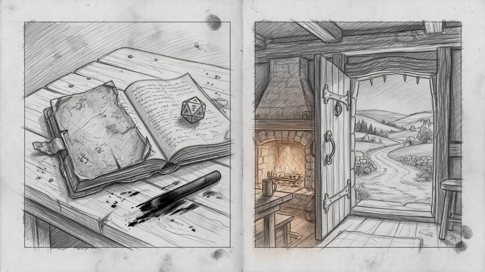

# 1. The model does not roll the dice

Elixir owns the board. The LLM owns what it feels like to stand on it.

| Deterministic (Elixir) | Storytelling (LLM) |
|------------------------|--------------------|
| 1d20, Learning Points, inventory, coins | Table GM: 2–5 paragraphs of what **this player perceived** |
| Clocks, occupancy, collisions in space and time | Never invents a skill check or a gold piece |
| Perception: hidden scouts stay hidden | Narrates a prepared nest only when that is already a fact |
| Pack markdown → the same opening every session | Never sees raw player text |

You can kill the prospector in this save. Breaking the Mining Guild is an epic. The world is literature. The session is a copy that starts to live after the inn door.

---

**Speaker notes.** The temptation with an “AI RPG” is to let the model be the rules. We refused. The server rolls. The model narrates. If those two disagree, the board wins.
