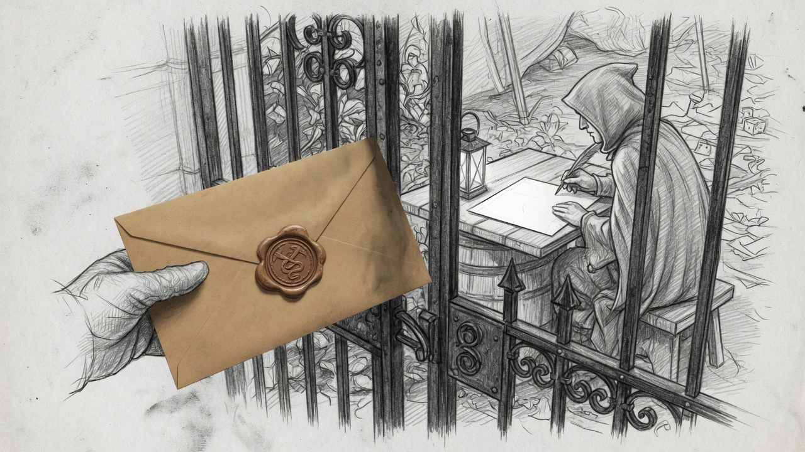
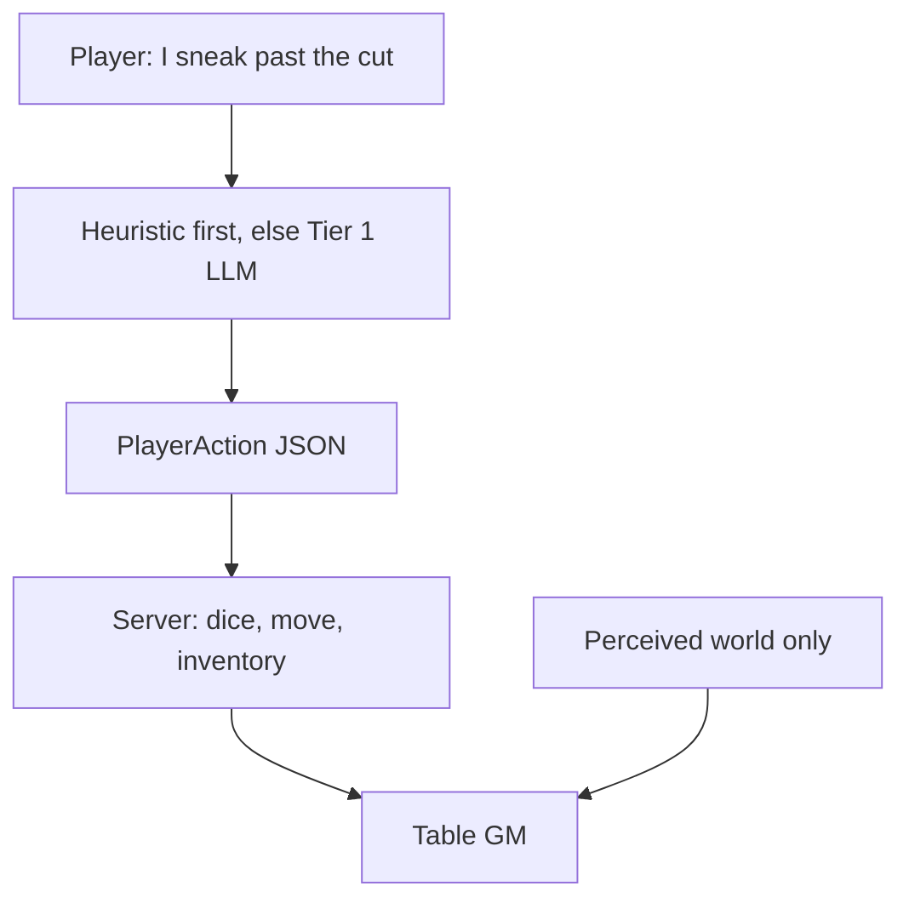

# 2. Raw player text never reaches the storyteller

Intent is a **contract**, not a vibe.

- **Tier 1** is the only prompt that sees messy language. Jailbreak theater lives there — not in the Guild’s brain, not in the GM.
- Clear “go to the square” is a heuristic (~0 ms). Ambiguity **asks**; it does not guess the plot.
- The table GM receives validated intent, a handler result, and facts. It **narrates**. It does not parse.

---

**Speaker notes.** Two-tier is not fashion. Raw text in the storyteller is how you get invented mechanics and prompt injection in the same breath. Heuristics keep the common case off the model so a full turn can stay under a few seconds.
