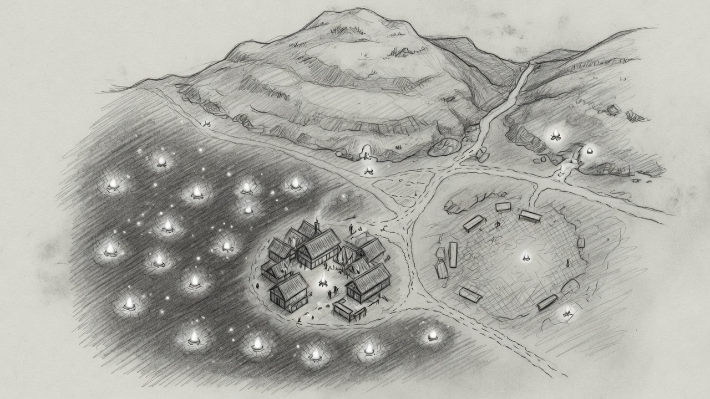

# 3. Language is expensive. Time is cheap — on the BEAM.

**LLMs** — few, expensive, language-shaped:

- Unclear intent → JSON
- Perceived scene / turn prose
- Front *thinking*: a short “you are the Guild…” plus `you_know` → a **plan** (async; a thinking model is allowed here)

**Elixir** — many, cheap, time-shaped:

- One process per **hot person**, not Inn ⊂ Village ⊂ Region as supervisors
- Oban: `:llm` for the table, `:sim` for plans that must not block the player
- WorldSim rules (missed scouts, dawdle clocks) with **no** model in the loop
- 1 000 instanced campaigns = 1 000 small trees. Postgres is the save; processes are the heat

The world is markdown. The opening is frozen. After the door we do not write every branch — we let people think, and we let the board refuse the impossible.

---

**Speaker notes.** Geography is data and PubSub, not a restart domain. If we had nested the atlas in OTP, walking from the inn to the square would have been a reparent. The BEAM win is isolation and queues, not a map-shaped tree.
